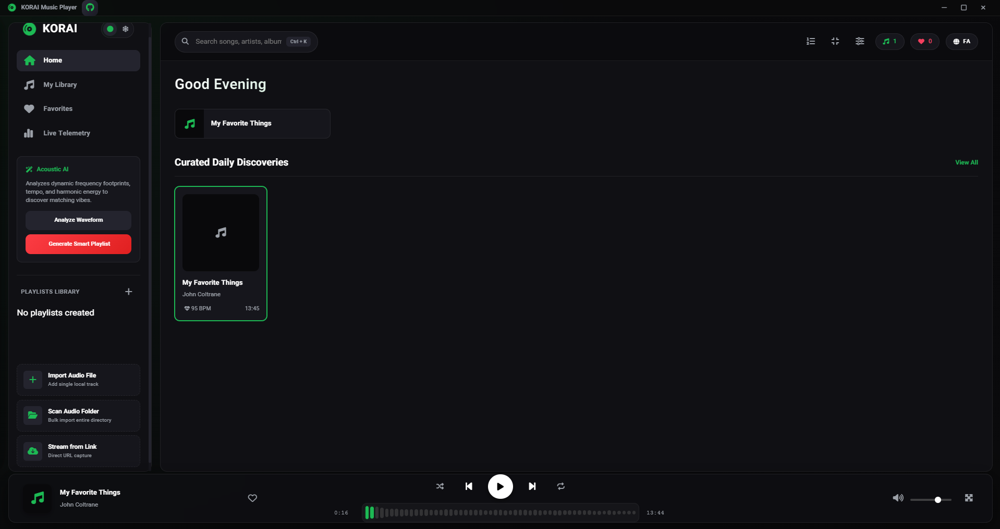
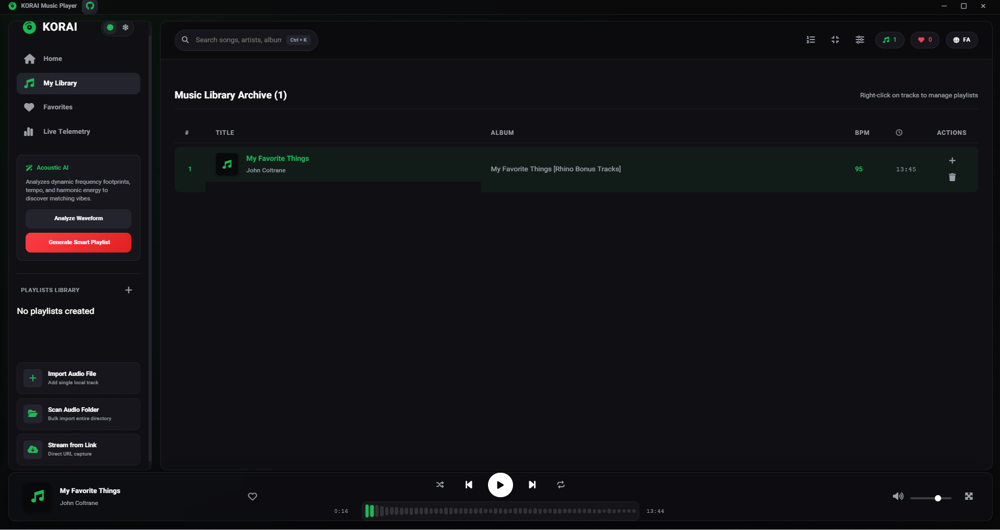
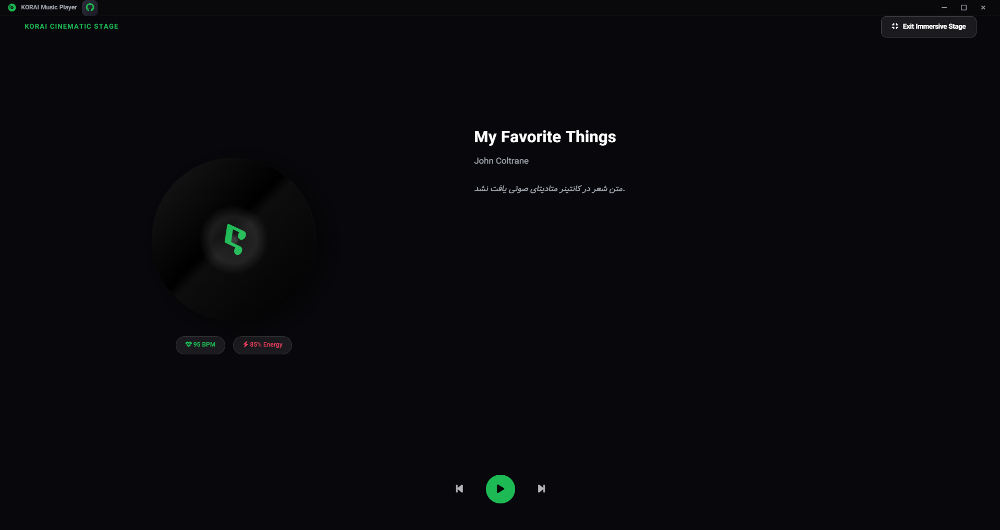
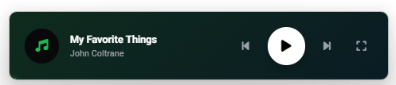
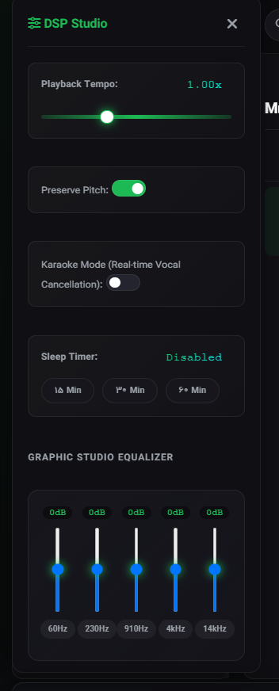

# 🎧 KORAI

<div align="center">


# KORAI Music Player
### Where Sound Meets Intelligence

Modern desktop music player with real-time DSP, smart audio analysis, and fully local experience.

[](https://github.com/Behdad-kanaani/korai-player/releases)
[](https://github.com/Behdad-kanaani/korai-player/releases)
[](...)
[](...)
[](...)
[](LICENSE)

</div>

---

## 📑 Table of Contents

- [About](#-about)
- [Why KORAI?](#-why-korai)
- [Screenshots](#-screenshots)
- [Features](#-features)
- [Keyboard Shortcuts](#-keyboard-shortcuts)
- [Installation](#-installation)
- [Development](#-development)
- [Build](#-build)
- [Requirements](#-requirements)
- [Project Structure](#-project-structure)
- [Technologies](#-technologies)
- [Privacy](#-privacy)
- [License](#-license)
---

## ✨ About

**KORAI is a free, modern desktop music player by Behdad Kanaani** built with Electron and Node.js.

Unlike other music players, KORAI gives you:
- 🎚️ **Real-time DSP** (5-band EQ, tempo control, karaoke mode)
- 🧠 **AI-powered recommendations** based on BPM & energy
- 🎬 **Cinematic fullscreen** with animated vinyl player
- 🌍 **Full Persian/English RTL support**
- 🖥️ **System tray & mini-player** (always-on-top)
- 🔒 **100% offline** — no telemetry, no cloud, no cost

> **Everything runs locally on your device. Your music stays yours.**


---
## 🎯 Why KORAI?

| Feature | KORAI | VLC | Spotify | Windows Media Player |
|---------|-------|-----|---------|---------------------|
| Free & Open Source | ✅ | ✅ | ❌ | ✅ |
| DSP (EQ, Karaoke) | ✅ | ❌ | ✅ (premium) | ❌ |
| AI Recommendations | ✅ | ❌ | ✅ (premium) | ❌ |
| Persian RTL | ✅ | ❌ | ❌ | ❌ |
| Mini-player | ✅ | ❌ | ✅ | ❌ |
| Offline First | ✅ | ✅ | ❌ | ✅ |

---
## 🖼 Screenshots

<div align="center">
  <table style="border-collapse: collapse; width: 100%; max-width: 1100px; margin: 0 auto; background: #0a0a0f; border-radius: 28px; padding: 24px; box-shadow: 0 25px 50px -12px rgba(0,0,0,0.5), 0 0 0 1px rgba(255,255,255,0.03) inset;">
    <tr>
      <td colspan="3" align="center" style="padding: 0 0 24px 0;">
        <span style="font-size: 13px; letter-spacing: 4px; color: #ff6b6b; font-family: 'SF Mono', monospace;">✦ GALLERY ✦</span>
        <div style="width: 60px; height: 2px; background: linear-gradient(90deg, #ff6b6b, #a855f7); margin: 12px auto 0;"></div>
      </td>
    </tr>
    <!-- ردیف اول: 3 کارت -->
    <tr>
      <td align="center" style="padding: 10px; width: 33.33%;">
        <div style="border-radius: 20px; overflow: hidden; background: #111116; box-shadow: 0 8px 20px rgba(0,0,0,0.4); transition: all 0.3s ease;" onmouseover="this.style.transform='translateY(-4px)'" onmouseout="this.style.transform='translateY(0)'">
          <div style="position: relative;">
            <div style="position: absolute; top: 12px; left: 12px; background: rgba(255,107,107,0.9); backdrop-filter: blur(4px); padding: 4px 12px; border-radius: 30px; font-size: 10px; font-weight: bold; color: white; font-family: monospace; z-index: 2;">01</div>
            
            <div style="position: absolute; bottom: 0; left: 0; right: 0; background: linear-gradient(0deg, #000 0%, transparent 100%); padding: 30px 12px 14px; text-align: center;">
              <span style="font-weight: 700; font-size: 14px; color: white;">🎧 Main Interface</span>
            </div>
          </div>
        </div>
      </td>
      <td align="center" style="padding: 10px; width: 33.33%;">
        <div style="border-radius: 20px; overflow: hidden; background: #111116; box-shadow: 0 8px 20px rgba(0,0,0,0.4); transition: all 0.3s ease;" onmouseover="this.style.transform='translateY(-4px)'" onmouseout="this.style.transform='translateY(0)'">
          <div style="position: relative;">
            <div style="position: absolute; top: 12px; left: 12px; background: rgba(78,205,196,0.9); backdrop-filter: blur(4px); padding: 4px 12px; border-radius: 30px; font-size: 10px; font-weight: bold; color: white; font-family: monospace; z-index: 2;">02</div>
            
            <div style="position: absolute; bottom: 0; left: 0; right: 0; background: linear-gradient(0deg, #000 0%, transparent 100%); padding: 30px 12px 14px; text-align: center;">
              <span style="font-weight: 700; font-size: 14px; color: white;">📚 Library View</span>
            </div>
          </div>
        </div>
      </td>
      <td align="center" style="padding: 10px; width: 33.33%;">
        <div style="border-radius: 20px; overflow: hidden; background: #111116; box-shadow: 0 8px 20px rgba(0,0,0,0.4); transition: all 0.3s ease;" onmouseover="this.style.transform='translateY(-4px)'" onmouseout="this.style.transform='translateY(0)'">
          <div style="position: relative;">
            <div style="position: absolute; top: 12px; left: 12px; background: rgba(255,230,109,0.9); backdrop-filter: blur(4px); padding: 4px 12px; border-radius: 30px; font-size: 10px; font-weight: bold; color: #000; font-family: monospace; z-index: 2;">03</div>
            
            <div style="position: absolute; bottom: 0; left: 0; right: 0; background: linear-gradient(0deg, #000 0%, transparent 100%); padding: 30px 12px 14px; text-align: center;">
              <span style="font-weight: 700; font-size: 14px; color: white;">🎬 Cinematic Mode</span>
            </div>
          </div>
        </div>
       </td>
    </tr>
    <!-- ردیف دوم: Mini Player (2 ستون) + DSP (1 ستون) -->
    <tr>
      <td colspan="2" align="center" style="padding: 10px; width: 66.66%;">
        <div style="border-radius: 20px; overflow: hidden; background: #111116; box-shadow: 0 8px 20px rgba(0,0,0,0.4); transition: all 0.3s ease;" onmouseover="this.style.transform='translateY(-4px)'" onmouseout="this.style.transform='translateY(0)'">
          <div style="position: relative;">
            <div style="position: absolute; top: 12px; left: 12px; background: rgba(251,146,60,0.9); backdrop-filter: blur(4px); padding: 4px 12px; border-radius: 30px; font-size: 10px; font-weight: bold; color: white; font-family: monospace; z-index: 2;">04</div>
            
            <div style="position: absolute; bottom: 0; left: 0; right: 0; background: linear-gradient(0deg, #000 0%, transparent 100%); padding: 30px 12px 14px; text-align: center;">
              <span style="font-weight: 700; font-size: 14px; color: white;">🎵 Mini Player</span>
              <span style="display: block; font-size: 10px; color: #fb923c; margin-top: 4px;">compact · elegant · always on top</span>
            </div>
          </div>
        </div>
       </td>
      <td align="center" style="padding: 10px; width: 33.33%;">
        <div style="border-radius: 20px; overflow: hidden; background: #111116; box-shadow: 0 8px 20px rgba(0,0,0,0.4); transition: all 0.3s ease;" onmouseover="this.style.transform='translateY(-4px)'" onmouseout="this.style.transform='translateY(0)'">
          <div style="position: relative;">
            <div style="position: absolute; top: 12px; left: 12px; background: rgba(168,85,247,0.9); backdrop-filter: blur(4px); padding: 4px 12px; border-radius: 30px; font-size: 10px; font-weight: bold; color: white; font-family: monospace; z-index: 2;">05</div>
            
            <div style="position: absolute; bottom: 0; left: 0; right: 0; background: linear-gradient(0deg, #000 0%, transparent 100%); padding: 30px 12px 14px; text-align: center;">
              <span style="font-weight: 700; font-size: 14px; color: white;">🎛️ DSP & Equalizer</span>
              <span style="display: block; font-size: 10px; color: #a855f7; margin-top: 4px;">10-band EQ · realtime DSP</span>
            </div>
          </div>
        </div>
       </td>
    </tr>
    <!-- فوتر -->
    <tr>
      <td colspan="3" align="center" style="padding: 24px 0 8px 0;">
        <div style="display: flex; justify-content: center; gap: 16px;">
          <span style="font-size: 10px; color: #3a3a4a; font-family: monospace;">✦ 5 views</span>
          <span style="font-size: 10px; color: #3a3a4a; font-family: monospace;">✦ cinematic ratio</span>
          <span style="font-size: 10px; color: #3a3a4a; font-family: monospace;">✦ hover to lift</span>
        </div>
      </td>
    </tr>
  </table>
</div>
---

### 🎵 Playback & Library

| Feature | Description |
|---------|-------------|
| **Audio Formats** | MP3, WAV, FLAC, OGG, M4A |
| **Queue System** | Dynamic playlist management |
| **Playback Modes** | Shuffle & Repeat (single/all) |
| **Speed Control** | 0.5x to 2.0x with pitch preservation |
| **Import Methods** | Drag & Drop, Folder recursive scanning |
| **Library Management** | Playlists, Favorites, File association |
| **Smart Search** | `Ctrl + K` for instant search |

### 🎚 Real-Time DSP

| Effect | Description |
|--------|-------------|
| **5-band Equalizer** | Graphic EQ with presets |
| **Karaoke Mode** | Vocal removal / center channel suppression |
| **Spectrum Analyzer** | Real-time live visualization |
| **Tempo Control** | Adjust BPM without pitch shift |
| **Sleep Timer** | Fade-out and auto-stop |

### 🧠 Smart Audio Analysis

| Analysis | Description |
|----------|-------------|
| **BPM Detection** | Automatic tempo detection |
| **RMS Energy** | Loudness & dynamic range |
| **Genre Detection** | Automatic genre classification |
| **Album Art** | Embedded cover extraction |
| **Lyrics** | Embedded lyrics extraction |
| **Recommendations** | Similar-track AI suggestions |
| **Smart Playlists** | Auto-generated based on listening history |

### 🎨 Interface

| Feature | Description |
|---------|-------------|
| **Fullscreen Mode** | Cinematic player with album art focus |
| **Vinyl Player** | Animated retro turntable |
| **Mini Player** | Floating always-on-top window |
| **Live Visualizers** | Audio-reactive animations |
| **Themes** | Spotify Dark, Liquid Glass |
| **RTL Support** | Full Persian/Farsi localization |
| **Responsive** | Adapts to any window size |

### 🖥 Desktop Integration

| Integration | Description |
|-------------|-------------|
| **System Tray** | Background playback controls |
| **Media Session API** | Modern Windows integration |
| **Multimedia Keys** | Full keyboard media control |
| **Lock Screen** | Playback controls on lock screen |
| **Custom Titlebar** | Native-looking frameless window |
| **Always-on-Top** | Mini-player stays above other apps |

---

## ⌨️ Keyboard Shortcuts

| Shortcut | Action |
|----------|--------|
| `Space` | Play / Pause |
| `ArrowLeft` | Seek backward 10 seconds |
| `ArrowRight` | Seek forward 10 seconds |
| `Ctrl + ArrowLeft` | Previous track |
| `Ctrl + ArrowRight` | Next track |
| `ArrowUp` | Increase volume (+10%) |
| `ArrowDown` | Decrease volume (-10%) |
| `M` | Mute / Unmute |
| `N` | Next track |
| `B` or `P` | Previous track |
| `S` | Stop playback |
| `F` | Toggle fullscreen cinematic mode |
| `Escape` | Exit fullscreen |
| `Ctrl + K` | Focus search bar |
| `Ctrl + L` | Focus library |
| `Ctrl + +` | Zoom in |
| `Ctrl + -` | Zoom out |
| `Ctrl + 0` | Reset zoom |
| **Media Keys** | Play, Pause, Next, Previous (full support) |

---

## 🌍 Languages

| Language | Support | Direction |
|----------|---------|-----------|
| English | ✅ Full | LTR |
| Persian (فارسی) | ✅ Full | RTL |

---

## 🎨 Themes

| Theme | Description |
|-------|-------------|
| **Spotify Dark** | Dark interface with green accent colors |
| **Liquid Glass** | Glassmorphism UI with blur and transparency effects |

---

## 📊 Statistics Dashboard

| Metric | Description |
|--------|-------------|
| Total Tracks | Number of songs in library |
| Total Plays | Cumulative play count |
| Favorite Count | Number of starred tracks |
| Most Played | Top song with play count |
| Recent Tracks | Last 10 played songs |
| Live Spectrum | Real-time frequency visualization |

---

## 🛠 Built With

| Technology | Usage |
|------------|-------|
| **Electron** | Cross-platform desktop framework |
| **Express** | Local API server for backend communication |
| **Web Audio API** | Real-time DSP engine and effects |
| **music-metadata** | Audio metadata extraction (ID3, Vorbis, etc.) |
| **Node-ID3** | ID3 tag fallback parser |
| **Font Awesome 6** | Icon system |
| **HTML5 Canvas** | Visualizers and animations |

---

## 🚀 Installation

### Download Pre-built Binaries

```bash
https://github.com/Behdad-kanaani/korai-player/releases/latest
```

| Platform | Package Format | File |
|----------|----------------|------|
| Windows  | NSIS Installer | `KORAI-Setup-{version}.exe` |
| macOS    | DMG | `KORAI-{version}.dmg` |
| Linux    | AppImage | `KORAI-{version}.AppImage` |

### Package Managers (Coming Soon)

```bash
# Windows (Chocolatey)
choco install korai

# macOS (Homebrew)
brew install korai

# Linux (Snap)
snap install korai
```

---

## 🧪 Development

### Clone Repository

```bash
git clone https://github.com/Behdad-kanaani/korai-player.git
cd korai-player
```

### Install Dependencies

```bash
npm install
```

### Run Development Mode

```bash
npm start
```

Runs KORAI in development mode with hot reload and dev tools.

---

## 📦 Build

### Platform-specific Builds

```bash
# Windows (NSIS Installer)
npm run dist:win

# macOS (DMG)
npm run dist:mac

# Linux (AppImage)
npm run dist:linux
```

### Build All Platforms

```bash
npm run dist
```

### Output Location

```
dist/
├── KORAI-Setup-{version}.exe    # Windows
├── KORAI-{version}.dmg          # macOS
└── KORAI-{version}.AppImage     # Linux
```

### Clean Build (Recommended)

```bash
rm -rf node_modules dist
npm install
npm run dist
```

---

## ⚙ Requirements

| Component | Minimum Version | Recommended |
|-----------|----------------|-------------|
| Node.js | 18.0.0 | 20.x LTS |
| npm | 9.0.0 | Latest |
| RAM | 512MB | 2GB+ |
| Storage | 200MB | 1GB+ (for library cache) |
| OS | Windows 10 / macOS 11 / Ubuntu 20.04 | Latest |

---

## 📁 Project Structure

```
korai-player/
│
├── main.js                      # Electron main process
├── preload.js                   # Secure IPC bridge
├── package.json                 # Dependencies & scripts
│
├── src/
│   ├── backend/
│   │   ├── server.js            # Express local API (port 3050)
│   │   ├── database.js          # SQLite/JSON storage
│   │   ├── analyzer.js          # BPM, RMS, genre detection
│   │   └── recommender.js       # AI similarity engine
│   │
│   └── frontend/
│       ├── index.html           # Main window UI
│       ├── styles.css           # Themes & styling
│       ├── app.js               # Frontend application logic
│       └── lang.js              # i18n (English/Persian)
├── korai.png                    # logo of Korai
├── screenshot                   # Folder of screenshots
└── node_modules/                # Dependencies (generated) - After > npm install
```
---

## 🗺 Roadmap

### ✅ v1.0 (Current)
- [x] Core playback engine
- [x] 5-band equalizer
- [x] BPM detection
- [x] System tray integration
- [x] Persian RTL support

### 🔄 v1.1 (In Progress)
- Wait For It ...

---

## 🤝 Contributing

### How to Contribute

1. Fork the repository
2. Create feature branch: `git checkout -b feature/amazing-feature`
3. Commit changes: `git commit -m 'feat: add amazing feature'`
4. Push: `git push origin feature/amazing-feature`
5. Open Pull Request

### Commit Convention

```
feat: add new feature
fix: bug fix
docs: documentation update
style: formatting change
refactor: code restructuring
perf: performance improvement
test: add or update tests
chore: maintenance task
```

### Development Guidelines

- Keep DSP processing efficient (< 5ms per frame)
- Support all major audio formats
- Maintain RTL compatibility for Persian
- Test on all three platforms before PR

---

## 📄 Changelog

### v1.0.0
- First Version

---

## 🙏 Acknowledgments

- [Electron](https://www.electronjs.org/) - Desktop framework
- [music-metadata](https://github.com/Borewit/music-metadata) - Audio parsing
- [Font Awesome](https://fontawesome.com/) - Icons

---

## 🔒 Privacy

**KORAI is fully local-first.**

| Data Type | Storage Location | Cloud Upload |
|-----------|------------------|--------------|
| Listening history | Local SQLite | ❌ Never |
| Audio files | Your file system | ❌ Never |
| Preferences | Local config | ❌ Never |
| Playlists | Local JSON | ❌ Never |
| Analytics | None | ❌ Never |

- ✅ No tracking
- ✅ No telemetry
- ✅ No cloud processing
- ✅ No external analytics
- ✅ No data collection

Your listening data never leaves your computer.

---

## 📜 License

Copyright © 2026 Behdad Kanaani

This project is licensed under the **Apache License 2.0** with an additional **Commons Clause**.

| Term | Status |
|------|--------|
| Use, modify, distribute source code | ✅ Allowed (under Apache 2.0) |
| Sell the Software or offer as a paid service | ❌ Prohibited (Commons Clause) |

### Summary

You are free to use, modify, and share this software **for personal or non-commercial purposes**.  
You **may not sell** this software or offer it as a paid service, even if modified.

### Commons Clause Notice

Without limiting other conditions in the License, the grant of rights under the License does not include the right to **Sell** the Software.

"Sell" means providing to third parties, for a fee or other consideration, a product or service whose value derives substantially from the functionality of the Software.

---

**TL;DR:** Free for personal use. Commercial sale or paid service is **not allowed**.


## 💬 Have Questions?

| Channel | Link |
|---------|------|
| **Issues** | [GitHub Issues](https://github.com/Behdad-kanaani/korai-player/issues) |
| **Discussions** | [GitHub Discussions](https://github.com/Behdad-kanaani/korai-player/discussions) |
---

<div align="center">

### ⭐ Star this project on GitHub if you find it useful!

**[Report Bug](https://github.com/Behdad-kanaani/korai-player/issues)** • **[Request Feature](https://github.com/Behdad-kanaani/korai-player/issues)** • **[Download Latest](https://github.com/Behdad-kanaani/korai-player/releases/latest)**

---

### Built with ❤️ by Behdad Kanaani
#### > **First of the KORAI Wave**
*Drop the algorithm. Listen with intelligence.*

</div>
