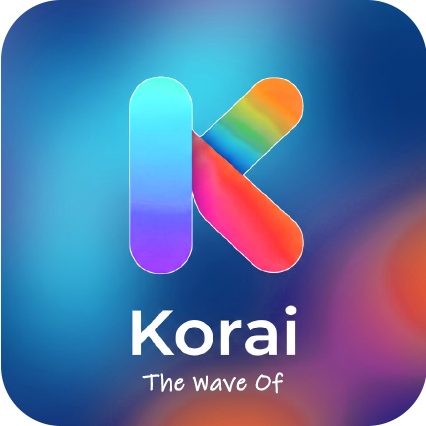
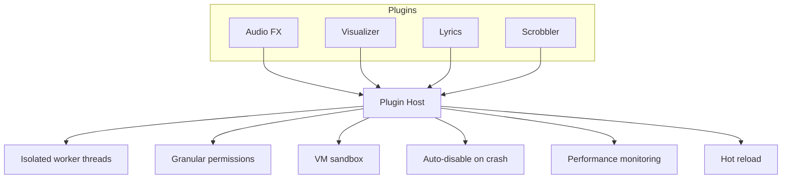
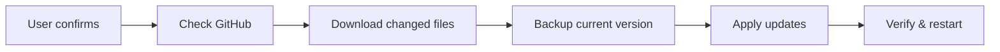
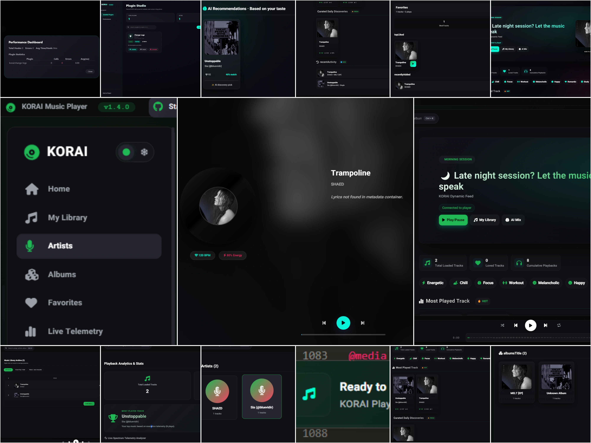
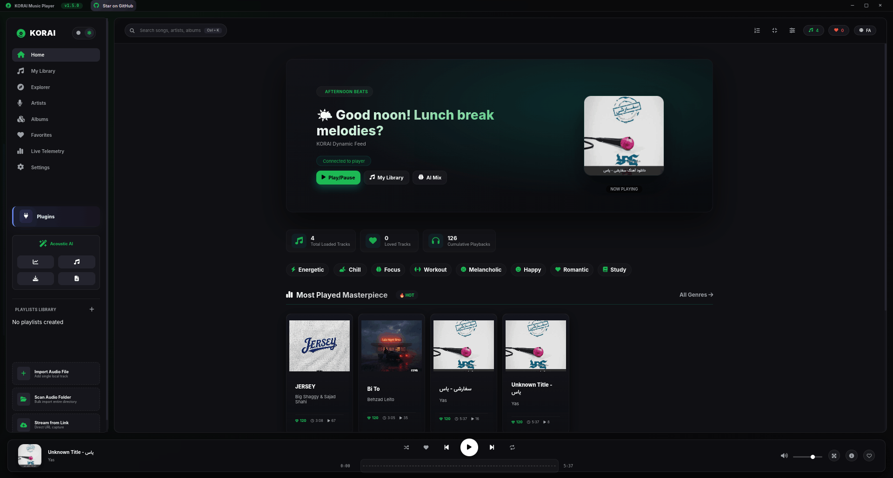

<div align="center">



# KORAI

### v1.5.0 — Open Source · Local First · Intelligence Built In

**No cloud. No tracking. No subscription. Just music.**

<br>

[](https://github.com/Behdad-kanaani/korai-player/releases)
[](https://github.com/Behdad-kanaani/korai-player/releases)
[](LICENSE)
[](https://github.com/Behdad-kanaani/korai-player)

[](https://github.com/Behdad-kanaani/korai-player/releases)
[](https://github.com/Behdad-kanaani/korai-player/releases)
[](https://github.com/Behdad-kanaani/korai-player/releases)

</div>

<br>

<p align="center">
  <a href="#the-proposition">Proposition</a> ·
  <a href="#feature-comparison">Features</a> ·
  <a href="#why-korai">Why KORAI?</a> ·
  <a href="#screenshots">Screenshots</a> ·
  <a href="#whats-new-in-v15">What's New</a> ·
  <a href="#technical-specifications">Tech Specs</a> ·
  <a href="#installation">Install</a> ·
  <a href="#roadmap">Roadmap</a> ·
  <a href="#license">License</a>
</p>

---

## The Proposition

Most music players either lock you into a cloud account, track your every listen, or sacrifice design for openness. KORAI is different.

It’s a **local-first, open-source player** that puts you back in control. No accounts. No telemetry. No feature paywalls. Just a polished, powerful app that respects your privacy — because every line of code is public and verifiable.

You own your music. KORAI just makes it sound incredible.

---

## Feature Comparison

See at a glance how KORAI stacks up against the popular alternatives.

### Privacy & openness

|                           | KORAI | Spotify | Apple Music | VLC  |
| ------------------------- | :---: | :-----: | :---------: | :--: |
| Open source (auditable)   | ✅    | ❌      | ❌          | ✅   |
| Zero telemetry / tracking | ✅    | ❌      | ❌          | ✅   |
| No account required       | ✅    | ❌      | ❌          | ✅   |
| Local-first (no cloud)    | ✅    | ❌      | ❌          | ✅   |
| Free forever              | ✅    | ❌      | ❌          | ✅   |

### Audio quality

| Feature                     | KORAI | Spotify | Apple Music | VLC  |
| --------------------------- | :---: | :-----: | :---------: | :--: |
| 10-band graphic EQ (32‑16k) | ✅    | ❌      | ❌          | ✅   |
| Real‑time spectrum analyzer | ✅    | ❌      | ❌          | ❌   |
| Live waveform on timeline   | ✅    | ❌      | ❌          | ❌   |
| Tempo control (0.5x‑2.0x)   | ✅    | ❌      | ❌          | ✅   |
| Gapless + Crossfade          | ✅    | ✅      | ✅          | ❌   |

### Intelligence (entirely offline)

| Feature                     | KORAI | Spotify | Apple Music | VLC  |
| --------------------------- | :---: | :-----: | :---------: | :--: |
| Local smart recommendations | ✅    | ❌      | ❌          | ❌   |
| BPM detection               | ✅    | ❌      | ❌          | ❌   |
| Energy + genre detection    | ✅    | ❌      | ❌          | ❌   |
| Context‑aware playback      | ✅    | ❌      | ❌          | ❌   |

### Extensibility & library control

| Feature                        | KORAI | Spotify | Apple Music | VLC       |
| ------------------------------ | :---: | :-----: | :---------: | :-------: |
| Plugin system + marketplace    | ✅    | ❌      | ❌          | ✅ / ❌   |
| Built‑in tag editor            | ✅    | ❌      | ❌          | ❌        |
| M3U / PLS / CUE support       | ✅    | ❌      | ❌          | ✅        |
| CSV export for analytics       | ✅    | ❌      | ❌          | ❌        |
| Full Persian / Farsi RTL       | ✅    | ❌      | ❌          | ❌        |

> **Everything in KORAI is free.** No “premium tier” — EQ, visualizers, tag editor, artist view, auto‑updates, and music explorer are all included forever.

---

## Why KORAI?

All the power of a modern music player, with none of the compromises.

### 🔒 Trust through transparency

KORAI is **100% open source**. Anyone can audit the code to confirm exactly what it does. Unlike closed‑source players where you have to trust a company’s word, KORAI lets you *verify*.

|                | Proprietary players      | Open‑source players      | KORAI                         |
| -------------- | ------------------------ | ------------------------ | ----------------------------- |
| **Code**       | Closed — trust required  | Public — verify yourself | Public + documented           |
| **Data**       | Leaves your device       | Stays local              | Never leaves your disk        |
| **Design**     | Polished                 | Often utilitarian        | Polished *and* local‑first    |
| **Intelligence** | Cloud‑driven           | Rare                     | Local recommendation engine   |

### 🧠 Local intelligence that never phones home

KORAI’s recommendation engine runs entirely on your machine. No listening history ever uploaded.

v1.5 uses a **5‑model hybrid recommender**:

| Component            | Weight | What it measures                         |
| -------------------- | :----: | ---------------------------------------- |
| Content similarity   |  40%   | Audio features (BPM, energy, genre)      |
| User preference      |  30%   | Listening habits & engagement            |
| Context awareness    |  15%   | Time of day, behavioral patterns         |
| Style similarity     |  10%   | Genre families & artist affinity         |
| Discovery bonus      |   5%   | Surfaces less‑played and new tracks      |

All processing uses heuristic weighting — no cloud AI, no data leaks. Audio analysis (brightness, warmth, roughness, harmonic content) is approximated from bitrate, duration, and BPM patterns rather than heavy DSP.

You also get **smart playlist generation** that builds coherent flows based on energy, genre, and mood.

### 🎚 Pro audio tools

KORAI comes packed with studio‑style controls:

- **10‑band graphic EQ** — precise frequency shaping from 32 Hz to 16 kHz
- **Real‑time spectrum analyzer** — see your music as it plays
- **Tempo shift** — 0.5x–2.0x with pitch preservation
- **Crossfade** — configurable 0–12 seconds
- **Gapless playback** — seamless transition between tracks

### 🧩 Extend with plugins

A full plugin ecosystem runs in isolated, sandboxed environments so a misbehaving plugin won’t crash the app.



- VM‑level isolation for safety
- Permissions system and performance dashboard
- Plugin CLI and **marketplace UI** (backend placeholder in v1.5)

### 🔄 Seamless updates (new in v1.5)

The in‑app updater fetches changed files directly from GitHub — no reinstallation required.



Atomic process with rollback support and clear color‑coded notifications.

### 🎨 Beautiful, responsive design

- **Liquid Glass theme** — soft glassmorphism with blur effects throughout
- **3D cover art** — scales and reacts to cursor hover
- **Live waveform timeline** — the progress bar pulses with your music
- **Marquee scrolling** for long titles, **artist cards**, and **spectrum analyzer**
- Full **RTL support** for Persian/Farsi — interface flip, metadata, and translated settings

### 🎛 You control your library

Edit metadata, fix album art, add lyrics. Export playlists as M3U/PLS or analyze your listening with CSV exports. No read‑only restrictions.

### ⚙ Smart playback modes

- **Repeat One**, **Smart Shuffle** (avoids repeats), **Context‑aware Shuffle**, **Preferred Genre Mode** (plays from your top genres based on likes/play counts)

### 🕹 Performance mode

Automatically detects low‑resource devices (< 4 GB RAM, < 4 CPU cores) and scales back visual effects without sacrificing audio quality. Manual override available.

---

## Screenshots

<div align="center">

| v1.4                              | v1.5                              |
| :-------------------------------: | :-------------------------------: |
|  |  |

*KORAI evolution — v1.4 (left) → v1.5 (right)*

</div>

---

## What’s New in v1.5

| Feature                       | Description                                          | Status |
| ----------------------------- | ---------------------------------------------------- | :----: |
| Auto‑Update System            | Atomic in‑app updates with rollback                  |   ✅   |
| Music Explorer                | Global search + MusicDel integration                 |   ✅   |
| Advanced Settings Dashboard   | Live‑synced, categorized settings                    |   ✅   |
| Preferred Genre Mode          | Genre‑based playback using your listening data       |   ✅   |
| Ensemble Recommender          | 5‑model hybrid recommendation engine                 |   ✅   |
| Plugin Performance Dashboard  | Per‑plugin execution stats                           |   ✅   |
| 10‑Band Graphic EQ            | Extended frequency control (32 Hz – 16 kHz)          |   ✅   |
| Liquid Glass Theme            | Glassmorphism applied app‑wide                       |   ✅   |
| Plugin Marketplace UI         | Browse and install plugins from the interface        |   🚧   |
| Audio Effects UI              | Reverb, chorus, delay, compression, distortion       |   🚧   |

**Also new:** resume‑on‑start, “Stay in Tray on Close”, context‑aware recommendations, enhanced audio analysis (brightness/warmth/roughness), MusicDel proxy, improved `analyzer.js`, and many fixes for scanning, shuffle controls, WAV reading, and settings persistence.

<details>
<summary><b>Code change summary (v1.4 → v1.5)</b></summary>
<br>

| Category               | Count  |
| ---------------------- | :----: |
| New files              |  10+   |
| Files updated          |  25+   |
| Lines added            | ~12,000 |
| Lines removed          | ~1,200 |
| New backend modules    |   4    |
| New frontend modules   |   6    |

</details>

---

## Technical Specifications

| Category                 | Specification                                           |
| ------------------------ | ------------------------------------------------------- |
| Audio formats            | MP3, FLAC (up to 24‑bit/192kHz), WAV, OGG, M4A         |
| Metadata                 | ID3v2.2/2.3/2.4, Vorbis comments, FLAC tags             |
| BPM detection            | Peak + autocorrelation + FFT onset (60–200 BPM, ±5 BPM) |
| Energy detection         | RMS‑based loudness analysis                             |
| EQ bands                 | 10: 32 Hz – 16 kHz                                      |
| Crossfade                | 0–12 s, configurable                                    |
| Tempo range              | 0.5x–2.0x, pitch‑preserved                              |
| Plugin system            | Isolated workers + VM sandbox + permissions + monitoring |
| Recommender              | 5‑model ensemble (40/30/15/10/5 weights)                |
| Memory (idle/play/50k+)  | ~120 MB / ~180 MB / ~250 MB                             |
| Storage                  | ~200 MB + library cache                                 |

---

## Known Limitations

We believe in being upfront:

- **Electron‑based** → memory usage ~180–250 MB. Chosen for rapid cross‑platform delivery.
- **Windows only** for now; macOS and Linux are on the roadmap.
- **BPM detection** gives ±5 BPM accuracy — great for tempo matching, not lab‑grade.
- **Music Explorer** requires internet, but your local library stays fully offline.
- **Plugin Marketplace UI** exists, but backend still uses placeholder URLs.
- **Audio analysis** uses heuristic approximations (bitrate/duration), not full DSP spectral analysis.

---

## Keyboard Shortcuts

| Shortcut                | Action                | Shortcut              | Action            |
| ----------------------- | --------------------- | --------------------- | ----------------- |
| `Space`                 | Play / Pause          | `M`                   | Mute              |
| `←` / `→`              | Seek ∓10s             | `F`                   | Toggle fullscreen |
| `Ctrl+←` / `Ctrl+→`    | Previous / Next       | `Esc`                 | Exit fullscreen   |
| `↑` / `↓`              | Volume ±10%           | `Ctrl+K`              | Focus search      |
| `N`                     | Next track            | `B`                   | Previous track    |

Media keys (Play, Pause, Next, Previous) work on all platforms.

---

## Advanced Search Syntax

```
bpm>120              BPM greater than 120
bpm<100              BPM less than 100
bpm:120-140          BPM between 120 and 140
genre:rock           Genre contains "rock"
genre:rock|metal     Genre is rock OR metal
genre:!pop           NOT pop (negation)
year:2020-2024       Year between 2020-2024
energy>0.7           Energy greater than 0.7
duration<240         Shorter than 4 minutes
playcount>10         Played more than 10 times
likecount>0          Has likes
artist:beatles       Artist contains "beatles"
title:love           Title contains "love"
q:hello world        Search title, artist, album, genre
```

---

## Project Structure

```
korai-player/
├── main.js                        Electron main process
├── preload.js                     Secure context bridge
├── package.json                   Dependencies (v1.5.0)
│
├── src/backend/
│   ├── server.js                  Express API (port 3050)
│   ├── database.js                JSON storage (debounced writes)
│   ├── analyzer.js                Metadata extraction (enhanced)
│   ├── recommender.js             Ensemble learning engine
│   ├── bpmDetector.js             BPM detection (3 algorithms)
│   ├── cueParser.js               CUE sheet parser
│   ├── playlistExporter.js        M3U / PLS / CSV exporter
│   ├── updater.js                 Auto‑update core
│   ├── updateManager.js           Atomic update management
│   ├── pluginManager.js           Plugin lifecycle
│   ├── pluginHost.js              Host process for workers
│   ├── pluginWorker.js            Isolated VM execution
│   ├── pluginRoutes.js            HTTP API for plugins
│   ├── pluginSettings.js          Per‑plugin config storage
│   ├── pluginPerformanceMonitor.js
│   ├── pluginHealthMonitor.js
│   └── worker/analyzer.worker.js
│
├── src/frontend/
│   ├── index.html · explorer.html · settings.html
│   ├── plugins.html · store.html
│   ├── styles.css · additional.css · settings.css · update.css
│   ├── app.js · lang.js · settings.js
│   ├── settingsStore.js · settingsSync.js · updateUI.js
│   ├── tagEditor.js · homePremium.js · homeEnhancements.js
│   ├── libraryMasonry.js · pluginManagerUI.js
│   ├── pluginStoreUI.js · additional.js
│
├── plugins/
│   └── korai-change-logs@1.0.0/
│
├── korai.png
└── screenshot/
```

---

## Installation

**Pre‑built binary** → [Latest release](https://github.com/Behdad-kanaani/korai-player/releases/latest)

| Platform | File                         | Status      |
| -------- | ---------------------------- | :---------: |
| Windows  | `KORAI-Setup-{version}.exe`  | ✅ Available |
| macOS    | —                            | 🚧 Planned   |
| Linux    | —                            | 🚧 Planned   |

**Build from source**

```bash
git clone https://github.com/Behdad-kanaani/korai-player.git
cd korai-player
npm install
npm start          # development mode
npm run dist:win   # build Windows installer
```

Requires **Node.js 18+** (20 LTS recommended) and **npm 9+**.

---

## Roadmap

| Version | Status          | Key Features                                                                                       |
| ------- | :-------------: | -------------------------------------------------------------------------------------------------- |
| v1.0    | ✅              | Core playback · 5‑band EQ · Persian RTL · System tray · BPM detection                              |
| v1.2    | ✅              | Liquid Glass theme · Tag editor · Gapless + Crossfade · M3U/PLS/CUE                                |
| v1.3    | ✅              | 3D cover art · Live waveform · Repeat One · Smart shuffle                                          |
| v1.4    | ✅              | Plugin architecture · Home redesign · Library masonry                                              |
| **v1.5** | ✅ **Current**  | Auto‑Update · Music Explorer · Settings Dashboard · 10‑band EQ · Ensemble Recommender · Preferred Genre · Plugin Marketplace |

---

## Contributing

```bash
git checkout -b feature/your-idea
git commit -m 'feat: description'
git push origin feature/your-idea
```

| Prefix      | Purpose                   |
| ----------- | ------------------------- |
| `feat:`     | New feature               |
| `fix:`      | Bug fix                   |
| `docs:`     | Documentation             |
| `refactor:` | Code restructuring        |
| `perf:`     | Performance improvement   |
| `chore:`    | Maintenance               |

Use `korai-plugin create` to scaffold new plugins quickly.

---

## Privacy

| Question               | Answer                                              |
| ---------------------- | --------------------------------------------------- |
| Open source?           | ✅ Fully auditable                                  |
| Can I audit the code?  | ✅ Every line is public                             |
| Telemetry?             | ❌ None, only localhost API and MusicDel proxy calls |
| Account required?      | ❌ No sign‑up, no login                             |
| Where is my data?      | `%APPDATA%\korai-player\` (Windows)                 |
| Can I delete it?       | ✅ Delete the userData folder or uninstall          |

---

## License

**Apache License 2.0 + Commons Clause** — Copyright © 2026 Behdad Kanaani

You are free to use, modify, and share KORAI for **non‑commercial** purposes. You may **not** sell it, offer it as a paid service, or charge for access to its functionality.

| Use case                                 | Allowed |
| ---------------------------------------- | :-----: |
| Personal use                             | ✅      |
| Non‑commercial sharing                   | ✅      |
| Modify & redistribute (non‑commercial)   | ✅      |
| Sell or sublicense                       | ❌      |
| Offer as SaaS                            | ❌      |

---

## Acknowledgments

[Electron](https://electronjs.org) · [music-metadata](https://github.com/Borewit/music-metadata) · [Node-ID3](https://github.com/zdrobin/node-id3) · [Express](https://expressjs.com) · [Font Awesome](https://fontawesome.com) · [adm-zip](https://github.com/cthackers/adm-zip) · [AJV](https://ajv.js.org) · [semver](https://github.com/npm/node-semver)

---

## Contact & Support

| Purpose                | Link                                                                               |
| ---------------------- | ---------------------------------------------------------------------------------- |
| 🐛 Report a bug        | [GitHub Issues](https://github.com/Behdad-kanaani/korai-player/issues)             |
| 💡 Request a feature   | [GitHub Issues](https://github.com/Behdad-kanaani/korai-player/issues)             |
| 💬 Discussion          | [GitHub Discussions](https://github.com/Behdad-kanaani/korai-player/discussions)   |
| ⬇️ Download            | [Releases](https://github.com/Behdad-kanaani/korai-player/releases)                |

---

<div align="center">

### ⭐ Star this repo if you believe in open source, privacy, and great software.

**Built with ❤️ by Behdad Kanaani**  
*First of the KORAI Wave*

*Local‑first. Privacy‑first. Intelligence built in.*

</div>
