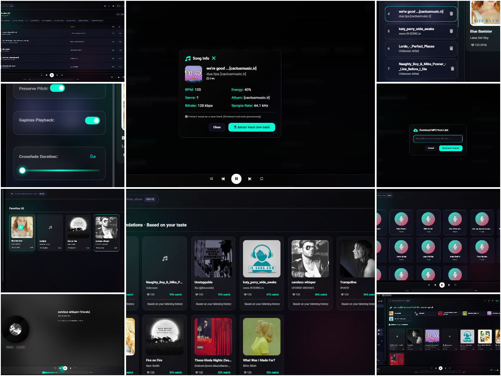

<div align="center">


# KORAI · v1.4

### *Open Source. Local First. Intelligence Built In.*

**No cloud. No tracking. No subscription. Just music.**

<br>

[](https://github.com/Behdad-kanaani/korai-player/releases)
[](https://github.com/Behdad-kanaani/korai-player/releases)
[](https://github.com/Behdad-kanaani/korai-player)
[](LICENSE)

[](https://github.com/Behdad-kanaani/korai-player/releases)
[](https://github.com/Behdad-kanaani/korai-player/releases) *(planned)*
[](https://github.com/Behdad-kanaani/korai-player/releases) *(planned)*

</div>

---

## 🎯 **Feature comparison**

| Feature | KORAI v1.4 | Spotify | Apple Music | VLC |
|---------|:-----:|:-------:|:-----------:|:---:|
| **Privacy** | | | | |
| Open source (auditable code) | ✅ | ❌ | ❌ | ✅ |
| Zero telemetry / tracking | ✅ | ❌ | ❌ | ✅ |
| No account required | ✅ | ❌ | ❌ | ✅ |
| Local-first (no cloud) | ✅ | ❌ | ❌ | ✅ |
| Free forever | ✅ | ❌ | ❌ | ✅ |
| **Audio Quality** | | | | |
| Graphic EQ | ✅ (5 bands) | ❌ | ❌ | ✅ (10 bands) |
| Real-time spectrum analyzer | ✅ | ❌ | ❌ | ❌ |
| Live waveform on timeline | ✅ | ❌ | ❌ | ❌ |
| Tempo control (0.5x–2.0x) | ✅ | ❌ | ❌ | ✅ |
| Gapless + Crossfade | ✅ | ✅ | ✅ | ❌ |
| **Intelligence** | | | | |
| Local smart recommendations | ✅ | ❌ | ❌ | ❌ |
| BPM detection | ✅ (3 algorithms) | ❌ | ❌ | ❌ |
| Energy + Genre detection | ✅ | ❌ | ❌ | ❌ |
| **Extensibility** | | | | |
| Plugin architecture | ✅ | ❌ | ❌ | ✅ |
| Plugin Marketplace | 🚧 v1.5 | ❌ | ❌ | ❌ |
| Audio effects framework | 🚧 v1.5 | ❌ | ❌ | ❌ |
| **Visual Experience** | | | | |
| 3D cover art + hover | ✅ | ❌ | ❌ | ❌ |
| Marquee scrolling text | ✅ | ❌ | ❌ | ❌ |
| Artist section with cards | ✅ | ✅ | ✅ | ❌ |
| Performance mode | ✅ | ❌ | ❌ | ❌ |
| **Library Control** | | | | |
| Built-in tag editor | ✅ | ❌ | ❌ | ❌ |
| M3U/PLS import/export | ✅ | ❌ | ❌ | ✅ |
| CUE sheet support | ✅ | ❌ | ❌ | ✅ |
| CSV export (analytics) | ✅ | ❌ | ❌ | ❌ |
| **Usability** | | | | |
| Persian/Farsi RTL | ✅ | ❌ | ❌ | ❌ |
| Mini-player + system tray | ✅ | ✅ | ❌ | ✅ |
| Media keys support | ✅ | ✅ | ✅ | ✅ |

> *KORAI has no "premium tier." Everything — EQ, visualizers, tag editor, artist view — is free forever.*

---

## 🔓 **Open source = verifiable privacy**

KORAI is **100% open source**. Every line of code is on GitHub for anyone to audit.

```
╔═══════════════════════════════════════════════════════════════════════════════╗
║                                                                               ║
║   Proprietary players (Spotify, Apple Music):                                 ║
║   → You cannot verify what data they collect. Their code is closed source.   ║
║   → Your listening habits become their product.                              ║
║                                                                               ║
║   Open source players (KORAI, VLC):                                           ║
║   → The code is public. You can check it yourself. No hidden telemetry.      ║
║   → Your data never leaves your computer.                                    ║
║                                                                               ║
║   KORAI takes it further:                                                     ║
║   → Not just open source, but beautifully designed open source.              ║
║   → Not just local, but intelligent local recommendations.                   ║
║                                                                               ║
╚═══════════════════════════════════════════════════════════════════════════════╝
```

**For privacy-focused users who refuse to compromise on design or intelligence, open source offers verifiable security.**

---

## 🧠 **What makes KORAI different**

### 1. Your data never leaves your computer

```
╔═══════════════════════════════════════════════════════════════════════════════╗
║                                                                               ║
║   KORAI:     Local JSON storage    →  Your hard drive only                   ║
║   Spotify:   Cloud database         →  Their servers (and third-parties)     ║
║   Apple:     Cloud + analytics      →  "We care about privacy" (trust us)    ║
║                                                                               ║
╚═══════════════════════════════════════════════════════════════════════════════╝
```

**No telemetry. No analytics. No "improvement programs." No trust required — verify it yourself.**

---

### 2. Smart recommendations that work offline

Unlike cloud-based recommendation engines that require your listening history to be uploaded, KORAI's similarity engine runs **entirely locally**.

| Metric | Weight | Description |
|--------|--------|-------------|
| Genre matching | 35 pts | Same genre family = highest score |
| BPM similarity | 30 pts | Tempo matching within estimated ±5 BPM |
| Energy (RMS) | 20 pts | Perceived loudness similarity |
| Loudness | 10 pts | Volume level matching |
| Discovery bonus | 8 pts | Prioritizes less-played tracks |

**Total possible score: 98 points** — no cloud needed, no listening history sent anywhere.

---

### 3. Pro audio tools for everyone

Real DSP features accessible to all users, not hidden behind "Pro" subscriptions:

| Feature | Specification |
|---------|---------------|
| **Equalizer** | 5 bands: 60Hz, 230Hz, 910Hz, 4kHz, 14kHz |
| **Spectrum analyzer** | Real-time frequency visualization |
| **Tempo shift** | 0.5x to 2.0x with pitch preservation |
| **Crossfade** | 0–12 seconds, configurable |
| **Gapless playback** | For albums that flow track to track |

---

### 4. Plugin System (NEW in v1.4)

KORAI now features a **complete plugin architecture** — extend functionality without modifying core code.

```
╔═══════════════════════════════════════════════════════════════════════════════╗
║                                                                               ║
║   ┌──────────────┐  ┌──────────────┐  ┌──────────────┐  ┌──────────────┐     ║
║   │ Audio FX     │  │ Visualizer   │  │ Lyrics       │  │ Scrobbler    │     ║
║   │ Plugin       │  │ Plugin       │  │ Plugin       │  │ Plugin       │     ║
║   └──────┬───────┘  └──────┬───────┘  └──────┬───────┘  └──────┬───────┘     ║
║          │                 │                 │                 │             ║
║          ▼                 ▼                 ▼                 ▼             ║
║   ┌─────────────────────────────────────────────────────────────────────┐     ║
║   │                         Plugin Host                                  │     ║
║   │  • Isolated worker threads  • Granular permissions                  │     ║
║   │  • VM sandbox              • Auto-disable on crash                  │     ║
║   │  • Performance monitoring   • Hot reload development                │     ║
║   └─────────────────────────────────────────────────────────────────────┘     ║
║                                                                               ║
╚═══════════════════════════════════════════════════════════════════════════════╝
```

| Plugin Feature | Status |
|----------------|--------|
| Isolated execution (VM sandbox) | ✅ Available now |
| Permissions system | ✅ Available now |
| Plugin CLI tool | ✅ Available now |
| Plugin Marketplace UI | 🚧 Coming in v1.5 |
| Audio effects UI | 🚧 Coming in v1.5 |

**Built-in plugin:** `korai/change-logs@1.0.0` — Display application change history

**Plugin permissions:**

| Permission | What it allows | User Approval |
|------------|----------------|:-------------:|
| `filesystem` | Read/write user-selected directories | ✅ Always |
| `network` | Outbound network requests | ✅ Always |
| `audio` | Register audio effects and process audio | ✅ Once |
| `preferences` | Read/write plugin settings | ✅ Once |
| `notifications` | Send system notifications | ✅ Once |
| `clipboard` | Read/write clipboard | ✅ Always |

**For developers:**

```bash
# Create a plugin in 30 seconds
npm install -g korai-plugin-cli
korai-plugin create my-plugin
korai-plugin dev my-plugin
korai-plugin pack my-plugin
```

---

### 5. Visual intelligence

KORAI doesn't just sound good — it looks like nothing else on your desktop.

| Visual Feature | What it does |
|----------------|---------------|
| **3D cover art** | Hover any album cover — it scales, glows, and reacts to your cursor |
| **Live waveform timeline** | The progress bar pulses and moves with your music's frequency |
| **Marquee scrolling** | Long song titles and artist names scroll elegantly when they don't fit |
| **Artist cards** | Browse your library by artist with album art, track counts, and instant play |
| **Spectrum analyzer** | Live frequency visualization in the stats panel |

**No other open source player looks like this. No other player combines privacy with this level of visual polish.**

---

### 6. You control your library

Wrong metadata? Fix it. Need to export your data? Do it. Want to see your listening patterns? Analyze it.

| Action | KORAI | Spotify / Apple Music |
|--------|:-----:|:---------------------:|
| Edit song title | ✅ | ❌ (read-only) |
| Fix artist name | ✅ | ❌ (read-only) |
| Add custom lyrics | ✅ | ❌ |
| Export playlist (M3U/PLS) | ✅ | ❌ |
| Import playlist | ✅ | ❌ |
| Parse CUE sheets | ✅ | ❌ |
| CSV export for analysis | ✅ | ❌ |
| Fix album art | ✅ | ❌ |

**Your library, your rules. Not a rental.**

---

### 7. Repeat One. Smart Shuffle. Finally.

| Mode | Description |
|------|-------------|
| **Repeat One** | Loop a single track. Perfect for learning a song or vibing to that one track. |
| **Smart Shuffle** | History tracking prevents repeats across library, playlists, favorites, and artist views. |
| **Context-aware** | Shuffle respects where you started (artist page? playlist? favorites?). |

---

### 8. Built for everyone (including Persian speakers)

KORAI includes full RTL (Right-to-Left) support:

- Persian/Farsi translation
- Interface flips automatically
- Metadata supports Persian characters
- Search works with Persian text

**Because great software should speak your language.**

---

### 9. Performance mode for older hardware

Not everyone has a gaming rig. KORAI v1.4 detects low-resource devices automatically.

- Automatic detection (RAM < 4GB, CPU cores < 4)
- Reduces visual effects where it matters
- Keeps audio playback buttery smooth

**Beautiful on high-end machines. Smooth on old laptops.**

---

## 🖼️ **Screenshots**

<div align="center">
  
| v1.3 | v1.4 |
|:----:|:----:|
|  |  |

*KORAI evolution — v1.3 (left) → v1.4 (right)*

</div>

---

## ⚙️ **Technical Specifications**

| Category | Specification |
|----------|---------------|
| **Audio Formats** | MP3, FLAC (24-bit/192kHz), WAV, OGG, M4A |
| **Metadata** | ID3v2.2/2.3/2.4, Vorbis comments, FLAC tags |
| **BPM Detection** | Peak + Autocorrelation + FFT onset (60–200 BPM) |
| **Energy Detection** | RMS-based loudness analysis |
| **EQ Bands** | 5 bands: 60Hz, 230Hz, 910Hz, 4kHz, 14kHz |
| **Crossfade** | 0–12 seconds (configurable) |
| **Tempo Range** | 0.5x – 2.0x (pitch-preserved) |
| **Plugin System** | Isolated workers + VM sandbox + permission model |
| **Memory (idle)** | ~120MB (Electron base) |
| **Memory (playing)** | ~180MB |
| **Memory (50k+ tracks)** | ~250MB (Electron + JSON cache) |
| **Storage** | ~200MB + library cache |

---

## 📋 **What's New in v1.4**

### ✨ New Features

| Feature | Description | Status |
|---------|-------------|--------|
| **Plugin architecture** | Isolated workers + VM sandbox + permission model | ✅ Available |
| **Plugin CLI tool** | `korai-plugin create`, `pack`, `validate`, `dev` | ✅ Available |
| **Home page redesign** | Cinematic hero + stats cards + mood chips | ✅ Available |
| **Library masonry** | CSS columns + virtual scrolling | ✅ Available |
| **3D cover art** | Hover effects with scale, glow, and shadow | ✅ Available |
| **Live waveform timeline** | 45 animated bars that pulse with your music | ✅ Available |
| **Repeat One mode** | Loop a single track | ✅ Available |
| **Smart shuffle** | History tracking prevents repeats | ✅ Available |
| **Performance mode** | Auto-detects low-resource devices | ✅ Available |

### 🚧 Coming in v1.5

| Feature | Description |
|---------|-------------|
| **Plugin Marketplace UI** | Browse, search, and install plugins from UI |
| **Audio effects UI** | Reverb, chorus, delay, compression, distortion |
| **10-band EQ** | Extended equalizer with more bands |
| **Vocal extraction** | High-fidelity vocal removal |
| **macOS + Linux builds** | Cross-platform support |

### 🔧 Improvements

- **Database**: Write debouncing (100ms), async file writes
- **Crossfade**: `exponentialRampToValueAtTime` (audio thread)
- **Visualizer**: Reduced to 20 FPS, visibility-based rendering
- **Image loading**: IntersectionObserver lazy loading

### 📊 Code Changes

| Category | v1.3 → v1.4 |
|----------|--------------|
| Files changed | 30+ |
| Lines added | ~7,500 |
| Lines removed | ~600 |
| New backend modules | 12 |
| New frontend modules | 8 |

---

## Known Limitations (honest and realistic)

- **Built with Electron** → ~180-250MB memory usage. You won't get a C++ memory footprint, but you get cross-platform compatibility.
- **Windows only currently** → macOS and Linux builds planned (no ETA).
- **5-band EQ, not 10-band** → More bands planned for v1.5.
- **BPM detection is estimated** → ~±5 BPM accuracy. Works great for matching tempos, not lab-grade.
- **Plugin Marketplace & Audio Effects UI** → Framework ready, UI coming in v1.5.

---

## ⌨️ **Keyboard Shortcuts**

| Shortcut | Action |
|----------|--------|
| `Space` | Play / Pause |
| `←` / `→` | Seek -10s / +10s |
| `Ctrl + ←` / `Ctrl + →` | Previous / Next |
| `↑` / `↓` | Volume +10% / -10% |
| `M` | Mute |
| `F` | Toggle fullscreen |
| `Esc` | Exit fullscreen |
| `Ctrl + K` | Focus search |
| `N` | Next track |
| `B` | Previous track |

**Media keys** (Play, Pause, Next, Previous) work on all platforms.

---

## 🔍 **Advanced Search Syntax**

```
bpm>120              → BPM greater than 120
bpm<100              → BPM less than 100
bpm:120-140          → BPM between 120 and 140
genre:rock           → Genre contains "rock"
genre:rock|metal     → Genre is rock OR metal
year:2020-2024       → Year between 2020-2024
energy>0.7           → Energy greater than 0.7
duration<240         → Shorter than 4 minutes
playcount>10         → Played more than 10 times
likecount>0          → Has likes
artist:beatles       → Artist contains "beatles"
title:love           → Title contains "love"
genre:!pop           → NOT pop (negation)
q:hello world        → Search title, artist, album, genre
```

---

## 📁 **Project Structure**

```
korai-player/
│
├── main.js                      # Electron main process
├── preload.js                   # Secure context bridge
├── package.json                 # Dependencies
│
├── src/
│   ├── backend/
│   │   ├── server.js            # Express API (port 3050)
│   │   ├── database.js          # JSON storage (debounced writes)
│   │   ├── analyzer.js          # Metadata extraction
│   │   ├── recommender.js       # Similarity engine
│   │   ├── bpmDetector.js       # BPM detection (3 algorithms)
│   │   ├── cueParser.js         # CUE sheet parser
│   │   ├── playlistExporter.js  # M3U/PLS/CSV exporter
│   │   ├── updater.js           # Auto-update notifications
│   │   ├── pluginManager.js     # Plugin lifecycle
│   │   ├── pluginHost.js        # Host process for workers
│   │   ├── pluginWorker.js      # Isolated VM execution
│   │   ├── pluginRoutes.js      # HTTP API for plugins
│   │   ├── pluginSettings.js    # Per-plugin config storage
│   │   ├── pluginPerformanceMonitor.js # CPU/memory tracking
│   │   ├── pluginHealthMonitor.js # Auto-disable on failures
│   │   └── worker/
│   │       └── analyzer.worker.js
│   │
│   └── frontend/
│       ├── index.html
│       ├── styles.css           # Liquid Glass + RTL
│       ├── additional.css       # v1.4 visual upgrades
│       ├── app.js               # Core player logic
│       ├── lang.js              # i18n (English/Persian)
│       ├── advancedSearch.js
│       ├── gaplessPlayer.js
│       ├── tagEditor.js
│       ├── homePremium.js       # Premium home page
│       ├── homeEnhancements.js  # Micro-interactions
│       ├── libraryMasonry.js    # Virtualized masonry
│       ├── pluginManagerUI.js   # Plugin management UI
│       ├── pluginStoreUI.js     # Marketplace UI (coming)
│       ├── plugins.html         # Plugin manager page
│       ├── store.html           # Marketplace page (coming)
│       └── additional.js        # Utility helpers
│
├── plugins/                     # Plugin installation directory
│   └── korai-change-logs@1.0.0/
│
├── korai.png
└── screenshot/
```

---

## 🚀 **Installation**

### Download pre-built binary

👉 [**github.com/Behdad-kanaani/korai-player/releases/latest**](https://github.com/Behdad-kanaani/korai-player/releases/latest)

### Windows (available now)

| Format | File |
|--------|------|
| NSIS installer | `KORAI-Setup-{version}.exe` |

👉 [**Download for Windows**](https://github.com/Behdad-kanaani/korai-player/releases/latest)

### macOS & Linux (planned)

| Platform | Status |
|----------|--------|
| macOS | 🚧 Planned |
| Linux | 🚧 Planned |

### Build from source

```bash
git clone https://github.com/Behdad-kanaani/korai-player.git
cd korai-player
npm install
npm start          # development mode
npm run dist:win   # build Windows installer
```

**Requirements:** Node.js 18+ (20 LTS recommended) · npm 9+

---

## 🗺️ **Roadmap**

| Version | Status | Key Features |
|---------|--------|--------------|
| **v1.0** | ✅ Released | Core playback · 5-band EQ · Persian RTL · System tray · BPM detection |
| **v1.2** | ✅ Released | Liquid Glass theme · Tag editor · Gapless + Crossfade · M3U/PLS/CUE |
| **v1.3** | ✅ Released | 3D cover art · Live waveform · Repeat One · Smart shuffle |
| **v1.4** | ✅ Current | **Plugin architecture · Home redesign · Library masonry** |
| **v1.5** | 🔄 Planned | Plugin Marketplace UI · Audio effects UI · 10-band EQ · Vocal extraction · macOS + Linux |

---

## 🤝 **Contributing**

```bash
git checkout -b feature/your-idea
git commit -m 'feat: description'
git push origin feature/your-idea
```

**Commit convention:**

| Prefix | Purpose |
|--------|---------|
| `feat:` | New feature |
| `fix:` | Bug fix |
| `docs:` | Documentation |
| `refactor:` | Code restructuring |
| `perf:` | Performance improvement |
| `chore:` | Maintenance |

**Plugin development:** Use `korai-plugin create` to scaffold new plugins.

---

## 🔒 **Privacy**

| Question | Answer |
|----------|--------|
| Is KORAI open source? | ✅ Yes — fully auditable |
| Can I audit the code? | ✅ Yes — every line is public |
| Does it send telemetry? | ❌ No — zero network requests except localhost API |
| Does it require an account? | ❌ No — no sign-up, no login |
| Where is my data stored? | `%APPDATA%\korai-player\` (Windows) |
| Can I delete my data? | ✅ Yes — delete userData folder or uninstall |

---

## 📜 **License**

**Apache License 2.0 + Commons Clause**

Copyright © 2026 Behdad Kanaani

```
Permission is hereby granted, free of charge, to any person obtaining a copy
of this software... to use, modify, and distribute for NON-COMMERCIAL purposes.

You may NOT:
  - Sell the Software
  - Offer the Software as a paid service
  - Charge for access to the Software's functionality
```

| Use Case | Allowed |
|----------|:-------:|
| Personal use | ✅ |
| Non-commercial sharing | ✅ |
| Modify and redistribute (non-commercial) | ✅ |
| Sell or sublicense | ❌ |
| Offer as SaaS | ❌ |

---

## 🙏 **Acknowledgments**

- [Electron](https://electronjs.org) — Cross-platform desktop framework
- [music-metadata](https://github.com/Borewit/music-metadata) — Audio metadata parsing
- [Node-ID3](https://github.com/zdrobin/node-id3) — ID3 tag reading/writing
- [Express](https://expressjs.com) — Local API server
- [Font Awesome](https://fontawesome.com) — Icons
- [adm-zip](https://github.com/cthackers/adm-zip) — Plugin packaging
- [AJV](https://ajv.js.org) — JSON schema validation

---

## 📞 **Contact & Support**

| Purpose | Link |
|---------|------|
| 🐛 Report bug | [GitHub Issues](https://github.com/Behdad-kanaani/korai-player/issues) |
| 💡 Request feature | [GitHub Issues](https://github.com/Behdad-kanaani/korai-player/issues) |
| 💬 Discussion | [GitHub Discussions](https://github.com/Behdad-kanaani/korai-player/discussions) |
| ⬇️ Download | [Releases](https://github.com/Behdad-kanaani/korai-player/releases) |

---

<div align="center">

### ⭐ **Star this repo if you believe in open source, privacy, and great software.**

---

**Built with ❤️ by Behdad Kanaani**  
*First of the KORAI Wave*

> *Local-first. Privacy-first. Intelligence built-in.*

---

*KORAI — Open source. Local first. Intelligence built in.*

</div>