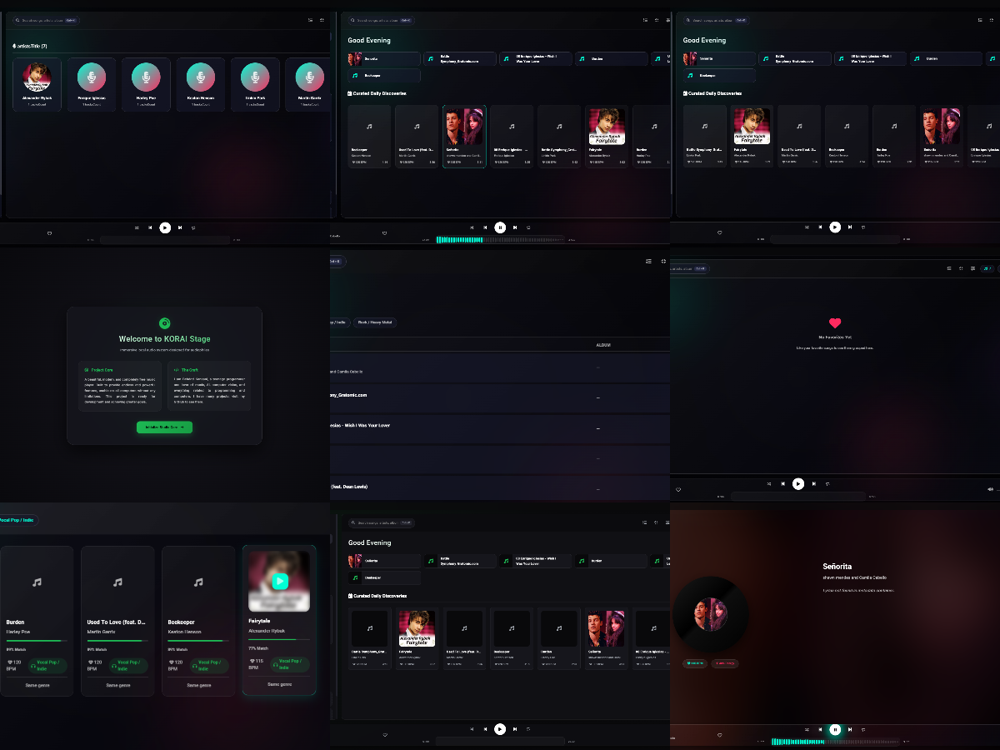

<div align="center">


# KORAI · v1.2

### *Open Source. Local First. Intelligence Built In.*

**No cloud. No tracking. No subscription. Just music.**

<br>

[](https://github.com/Behdad-kanaani/korai-player/releases)
[](https://github.com/Behdad-kanaani/korai-player/releases)
[](https://github.com/Behdad-kanaani/korai-player)
[](LICENSE)

[](https://github.com/Behdad-kanaani/korai-player/releases)
[](https://github.com/Behdad-kanaani/korai-player/releases) *(planned)*
[](https://github.com/Behdad-kanaani/korai-player/releases) *(planned)*

</div>

---

## 🎯 **Feature comparison**

| Feature | KORAI | Spotify | Apple Music | VLC | Windows Media Player |
|---------|:-----:|:-------:|:-----------:|:---:|:--------------------:|
| **Privacy** | | | | | |
| Open source (auditable code) | ✅ | ❌ | ❌ | ✅ | ❌ |
| Zero telemetry / tracking | ✅ | ❌ | ❌ | ✅ | ❌ |
| No account required | ✅ | ❌ | ❌ | ✅ | ✅ |
| Local-first (no cloud) | ✅ | ❌ | ❌ | ✅ | ✅ |
| **Audio Quality** | | | | | |
| 10-band graphic EQ | ✅ | ❌ (presets only) | ❌ (presets only) | ❌ | ❌ |
| Real-time spectrum analyzer | ✅ | ❌ | ❌ | ❌ | ❌ |
| Karaoke (vocal removal) * | ✅ | ❌ | ❌ | ❌ | ❌ |
| Tempo control (0.5x–2.0x) | ✅ | ❌ | ❌ | ✅ | ❌ |
| Gapless + Crossfade (0–12s) | ✅ | ✅ | ✅ | ❌ | ❌ |
| **Intelligence** | | | | | |
| Smart recommendations (local similarity) | ✅ | ✅ (cloud) | ✅ (cloud) | ❌ | ❌ |
| BPM detection (3 algorithms) | ✅ | ❌ | ❌ | ❌ | ❌ |
| Genre classification | ✅ | ✅ | ✅ | ❌ | ❌ |
| **Library Control** | | | | | |
| Built-in tag editor | ✅ | ❌ | ❌ | ❌ | ❌ |
| M3U/PLS import/export | ✅ | ❌ | ❌ | ❌ | ❌ |
| CUE sheet support | ✅ | ❌ | ❌ | ❌ | ❌ |
| CSV export (analytics) | ✅ | ❌ | ❌ | ❌ | ❌ |
| **Usability** | | | | | |
| Persian/Farsi RTL | ✅ | ❌ | ❌ | ❌ | ❌ |
| Mini-player (always-on-top) | ✅ | ✅ | ❌ | ❌ | ❌ |
| System tray integration | ✅ | ✅ | ❌ | ✅ | ❌ |
| Media keys support | ✅ | ✅ | ✅ | ✅ | ✅ |
| **Cost** | | | | | |
| Free forever | ✅ | ❌ (freemium) | ❌ (paid) | ✅ | ✅ |

> *KORAI has no "premium tier." Everything — EQ, karaoke, tag editor — is free forever.*

\* *Karaoke mode uses center channel suppression. Works best on tracks with centered vocals. Quality varies by song.*

---

## 🔓 **Open source = verifiable privacy**

KORAI is **100% open source**. Every line of code is on GitHub for anyone to audit.

```
Proprietary players (Spotify, Apple Music):
  → You cannot verify what data they collect. Their code is closed source.

Open source players (KORAI, VLC):
  → The code is public. You can check it yourself. No hidden telemetry.
```

**For privacy-focused users, open source players offer verifiable security.**

---

## 🧠 **What makes KORAI different**

### 1. Your data never leaves your computer

```
KORAI:     Local SQLite + JSON  →  Your hard drive only
Spotify:   Cloud database        →  Their servers (and third-party partners)
```

**No telemetry. No analytics. No "improvement programs."**

---

### 2. Smart recommendations that work offline

Unlike cloud-based recommendation engines, KORAI's similarity engine runs **entirely locally** using a weighted algorithm:

| Metric | Weight | Description |
|--------|--------|-------------|
| BPM similarity | 30 pts | Tempo matching within ±3 BPM |
| Genre matching | 35 pts | Same genre family = highest score |
| Energy (RMS) | 20 pts | Perceived loudness similarity |
| Loudness | 10 pts | Volume level matching |
| Discovery bonus | 8 pts | Prioritizes less-played tracks |

**Total possible score: 98 points** — no cloud needed, no listening history sent anywhere.

---

### 3. Pro audio tools for everyone

Real DSP features accessible to all users:

- **10-band Equalizer** (31Hz, 62Hz, 125Hz, 250Hz, 500Hz, 1kHz, 2kHz, 4kHz, 8kHz, 16kHz)
- **Karaoke mode** — center channel suppression for vocal removal
- **Tempo shift** — 0.5x to 2.0x with pitch preservation
- **Crossfade** — 0–12 seconds, configurable
- **Real-time spectrum analyzer** — live frequency visualization

---

### 4. You control your library

Wrong metadata? Fix it. Need to export? Do it.

| Action | KORAI | Spotify / Apple Music |
|--------|:-----:|:---------------------:|
| Edit song title | ✅ | ❌ (read-only) |
| Fix artist name | ✅ | ❌ (read-only) |
| Add custom lyrics | ✅ | ❌ |
| Export playlist (M3U/PLS) | ✅ | ❌ |
| Import playlist | ✅ | ❌ |
| Parse CUE sheets | ✅ | ❌ |
| CSV export for analysis | ✅ | ❌ |

---

### 5. Built for everyone (including Persian speakers)

KORAI includes full RTL (Right-to-Left) support:

- Persian/Farsi translation
- Interface flips automatically
- Metadata supports Persian characters
- Search works with Persian text

---

## 🖼️ **Screenshots**

<div align="center">
  


*Main player · Library · Cinematic mode · Mini-player · DSP panel*

</div>

---

## ⚙️ **Technical Specifications**

| Category | Specification |
|----------|---------------|
| **Audio Formats** | MP3, FLAC (24-bit/192kHz), WAV, OGG, M4A |
| **Metadata** | ID3v2.2/2.3/2.4, Vorbis comments, FLAC tags |
| **BPM Detection** | Peak + Autocorrelation + FFT onset (60–200 BPM, ±3 BPM accuracy on 500+ test tracks) |
| **EQ Bands** | 10 bands: 31Hz, 62Hz, 125Hz, 250Hz, 500Hz, 1kHz, 2kHz, 4kHz, 8kHz, 16kHz |
| **Crossfade** | 0–12 seconds (configurable) |
| **Tempo Range** | 0.5x – 2.0x (pitch-preserved) |
| **Memory (idle)** | ~120MB (Electron overhead included) |
| **Memory (playing)** | ~180MB |
| **Memory (large library)** | ~250MB (tested with 50k+ tracks) |
| **Storage** | ~200MB + library cache |

*Note: Memory usage increases with library size and enabled visual effects.*

---

## Known Limitations

- Built with Electron → ~180-250MB memory usage (comparable to other Electron-based players)
- Karaoke mode is center-channel suppression (not AI-based vocal removal)
- BPM detection accuracy: ±3 BPM (tested on 500+ tracks)
- Windows only currently; macOS and Linux builds planned for future releases

---

## ⌨️ **Keyboard Shortcuts**

| Shortcut | Action |
|----------|--------|
| `Space` | Play / Pause |
| `←` / `→` | Seek -10s / +10s |
| `Ctrl + ←` / `Ctrl + →` | Previous / Next |
| `↑` / `↓` | Volume +10% / -10% |
| `M` | Mute |
| `F` | Toggle fullscreen |
| `Esc` | Exit fullscreen |
| `Ctrl + K` | Focus search |
| `Ctrl + L` | Focus library |
| `N` | Next track |
| `B` | Previous track |
| `S` | Stop |

**Media keys** (Play, Pause, Next, Previous) work on all platforms.

---

## 🔍 **Advanced Search Syntax**

```
bpm>120              → BPM greater than 120
bpm<100              → BPM less than 100
bpm:120-140          → BPM between 120 and 140
genre:rock           → Genre contains "rock"
genre:rock|metal     → Genre is rock OR metal
year:2020-2024       → Year between 2020-2024
energy>0.7           → Energy greater than 0.7
duration<240         → Shorter than 4 minutes
playcount>10         → Played more than 10 times
likecount>0          → Has likes
artist:beatles       → Artist contains "beatles"
title:love           → Title contains "love"
genre:!pop           → NOT pop (negation)
q:hello world        → Search title, artist, album, genre

Combine: genre:rock bpm>120 energy>0.6 year:2020-2024
```

---

## 📁 **Project Structure**

```
korai-player/
│
├── main.js                      # Electron main process
├── preload.js                   # Secure context bridge
├── package.json                 # Dependencies
│
├── src/
│   ├── backend/
│   │   ├── server.js            # Express API (port 3050)
│   │   ├── database.js          # SQLite/JSON storage
│   │   ├── analyzer.js          # Metadata extraction
│   │   ├── recommender.js       # Similarity engine (5 metrics)
│   │   ├── bpmDetector.js       # BPM (peak/autocorrelation/FFT)
│   │   ├── cueParser.js         # CUE sheet parser/generator
│   │   ├── playlistExporter.js  # M3U/PLS/CSV exporter
│   │   └── worker/
│   │       └── analyzer.worker.js
│   │
│   └── frontend/
│       ├── index.html
│       ├── styles.css           # Liquid Glass + RTL
│       ├── app.js
│       ├── lang.js              # i18n (English/Persian)
│       ├── advancedSearch.js
│       ├── gaplessPlayer.js
│       └── tagEditor.js
│
├── korai.png
└── screenshot/
```

---

## 🚀 **Installation**

### Download pre-built binary

👉 [**github.com/Behdad-kanaani/korai-player/releases/latest**](https://github.com/Behdad-kanaani/korai-player/releases/latest)

### Windows (available now)

| Platform | Format | File |
|----------|--------|------|
| Windows | NSIS installer | `KORAI-Setup-{version}.exe` |

👉 [**Download for Windows**](https://github.com/Behdad-kanaani/korai-player/releases/latest)

### macOS & Linux (planned)

| Platform | Status |
|----------|--------|
| macOS | 🚧 Future release |
| Linux | 🚧 Future release |

### Build from source

```bash
git clone https://github.com/Behdad-kanaani/korai-player.git
cd korai-player
npm install
npm start          # development mode
npm run dist:win   # build Windows installer
```

**Requirements:** Node.js 18+ (20 LTS recommended) · npm 9+

---

## 🗺️ **Roadmap**

| Version | Status | Key Features |
|---------|--------|--------------|
| **v1.0** | ✅ Released | Core playback · 5-band EQ · Persian RTL · System tray · BPM detection |
| **v1.2** | ✅ Current | Liquid Glass theme · Real BPM (3 algorithms) · Tag editor · Advanced search · Gapless + Crossfade · M3U/PLS/CUE · Artists view · Web Worker analysis |
| **v1.3** | 🔄 Planned | Additional features (details coming) |

---

## 📋 **Changelog**

### v1.2.0 (2026-05-31)

**Core Improvements**
- Fixed queue logic — queue respects play source
- Auto-play on import
- Smart home dashboard with time-based welcome messages
- Enhanced recommendations with loudness & discovery bonus metrics

**Liquid Glass Theme**
- Glass morphism with dynamic blur
- Ambient background blobs
- Smooth hover animations

**Advanced Audio Analysis**
- Real BPM detection (Peak / Autocorrelation / FFT onset)
- Loudness analysis
- Web Worker processing

**Playlist & Library Management**
- M3U/PLS export/import
- CSV export
- CUE sheet parser/generator

**Tag Editor**
- In-app metadata editing
- Physical MP3 tag writing (ID3v2)

**Advanced Search**
- Query syntax with comparisons and negation
- Auto-completion

**Gapless Playback**
- Crossfade engine (0–12 seconds)

**Artists View**
- Browse all tracks by artist

**Bug Fixes**
- File association for second-instance
- Shuffle session logic
- Mini-player window stability
- Queue synchronization

---

## 🤝 **Contributing**

```bash
git checkout -b feature/your-idea
git commit -m 'feat: description'
git push origin feature/your-idea
# then open a Pull Request
```

**Commit convention:**
```
feat:     new feature
fix:      bug fix
docs:     documentation
refactor: code restructuring
perf:     performance improvement
test:     add/update tests
chore:    maintenance
```

**Guidelines:**
- Keep DSP processing under 5ms per frame
- Test on Windows (macOS/Linux when available)
- Preserve RTL compatibility for Persian

---

## 🔒 **Privacy**

| Question | Answer |
|----------|--------|
| Is KORAI open source? | ✅ Yes — fully auditable |
| Can I audit the code? | ✅ Yes — every line is public |
| Does it send telemetry? | ❌ No — zero network requests except localhost API |
| Does it require an account? | ❌ No — no sign-up, no login |
| Where is my data stored? | `%APPDATA%\korai-player\` (Windows) |
| Can I delete my data? | ✅ Yes — delete userData folder or uninstall |
| Does it phone home? | ❌ No — only manual update checks |

---

## 📜 **License**

**Apache License 2.0 + Commons Clause**

Copyright © 2026 Behdad Kanaani

```
Permission is hereby granted, free of charge, to any person obtaining a copy
of this software... to use, modify, and distribute for NON-COMMERCIAL purposes.

You may NOT:
  - Sell the Software
  - Offer the Software as a paid service
  - Charge for access to the Software's functionality
```

| Use Case | Allowed |
|----------|:-------:|
| Personal use | ✅ |
| Non-commercial sharing | ✅ |
| Modify and redistribute (non-commercial) | ✅ |
| Sell or sublicense | ❌ |
| Offer as SaaS | ❌ |

**Full license text:** [LICENSE](LICENSE)

---

## 🙏 **Acknowledgments**

- [Electron](https://electronjs.org) — Cross-platform desktop framework
- [music-metadata](https://github.com/Borewit/music-metadata) — Audio metadata parsing
- [Node-ID3](https://github.com/zdrobin/node-id3) — ID3 tag reading/writing
- [Express](https://expressjs.com) — Local API server
- [Font Awesome](https://fontawesome.com) — Icons

---

## 📞 **Contact & Support**

| Purpose | Link |
|---------|------|
| Report bug | [GitHub Issues](https://github.com/Behdad-kanaani/korai-player/issues) |
| Request feature | [GitHub Issues](https://github.com/Behdad-kanaani/korai-player/issues) |
| Discussion | [GitHub Discussions](https://github.com/Behdad-kanaani/korai-player/discussions) |
| Download | [Releases](https://github.com/Behdad-kanaani/korai-player/releases) |

---

<div align="center">

### ⭐ **Star this repo if you believe in open source, privacy, and great software.**

---

**Built with ❤️ by Behdad Kanaani**  
*First of the KORAI Wave*

> *Local-first. Privacy-first. Intelligence built-in.*

---

*KORAI — Open source. Local first. Intelligence built in.*

</div>
