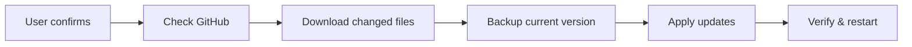
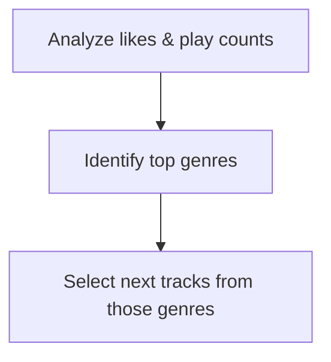
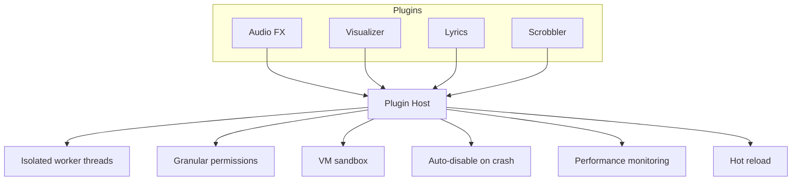

<div align="center">


# KORAI
### v1.5.0 — Open Source · Local First · Intelligence Built In

**No cloud. No tracking. No subscription. Just music.**

<br>

[](https://github.com/Behdad-kanaani/korai-player/releases)
[](https://github.com/Behdad-kanaani/korai-player/releases)
[](LICENSE)
[](https://github.com/Behdad-kanaani/korai-player)

[](https://github.com/Behdad-kanaani/korai-player/releases)
[](https://github.com/Behdad-kanaani/korai-player/releases)
[](https://github.com/Behdad-kanaani/korai-player/releases)

</div>

<br>

<p align="center">
  <a href="#the-proposition">Proposition</a> ·
  <a href="#feature-comparison">Features</a> ·
  <a href="#what-makes-korai-different">Highlights</a> ·
  <a href="#screenshots">Screenshots</a> ·
  <a href="#installation">Install</a> ·
  <a href="#roadmap">Roadmap</a> ·
  <a href="#license">License</a>
</p>

---

## The Proposition

In a world where your listening habits are packaged, sold, and analyzed without your consent — where "premium" means paying for features that should be free — **KORAI stands apart.**

Not as a protest. As a better way.

This is a player that answers to no one but you. No servers watching. No algorithms feeding your data to advertisers. No tiered subscriptions holding basic features hostage. Just software that does what it says — because every line of code is public for anyone to verify.

---

## Feature Comparison

<table>
<tr><th align="left">Privacy</th><th>KORAI</th><th>Spotify</th><th>Apple Music</th><th>VLC</th></tr>
<tr><td>Open source (auditable code)</td><td align="center">✅</td><td align="center">❌</td><td align="center">❌</td><td align="center">✅</td></tr>
<tr><td>Zero telemetry / tracking</td><td align="center">✅</td><td align="center">❌</td><td align="center">❌</td><td align="center">✅</td></tr>
<tr><td>No account required</td><td align="center">✅</td><td align="center">❌</td><td align="center">❌</td><td align="center">✅</td></tr>
<tr><td>Local-first (no cloud)</td><td align="center">✅</td><td align="center">❌</td><td align="center">❌</td><td align="center">✅</td></tr>
<tr><td>Free forever</td><td align="center">✅</td><td align="center">❌</td><td align="center">❌</td><td align="center">✅</td></tr>
</table>

<table>
<tr><th align="left">Audio Quality</th><th>KORAI</th><th>Spotify</th><th>Apple Music</th><th>VLC</th></tr>
<tr><td>Graphic EQ (10 bands)</td><td align="center">✅</td><td align="center">❌</td><td align="center">❌</td><td align="center">✅</td></tr>
<tr><td>Real-time spectrum analyzer</td><td align="center">✅</td><td align="center">❌</td><td align="center">❌</td><td align="center">❌</td></tr>
<tr><td>Live waveform on timeline</td><td align="center">✅</td><td align="center">❌</td><td align="center">❌</td><td align="center">❌</td></tr>
<tr><td>Tempo control (0.5x–2.0x)</td><td align="center">✅</td><td align="center">❌</td><td align="center">❌</td><td align="center">✅</td></tr>
<tr><td>Gapless + Crossfade</td><td align="center">✅</td><td align="center">✅</td><td align="center">✅</td><td align="center">❌</td></tr>
</table>

<table>
<tr><th align="left">Intelligence</th><th>KORAI</th><th>Spotify</th><th>Apple Music</th><th>VLC</th></tr>
<tr><td>Local smart recommendations</td><td align="center">✅</td><td align="center">❌</td><td align="center">❌</td><td align="center">❌</td></tr>
<tr><td>BPM detection</td><td align="center">✅</td><td align="center">❌</td><td align="center">❌</td><td align="center">❌</td></tr>
<tr><td>Energy + genre detection</td><td align="center">✅</td><td align="center">❌</td><td align="center">❌</td><td align="center">❌</td></tr>
<tr><td>Context-aware playback</td><td align="center">✅</td><td align="center">❌</td><td align="center">❌</td><td align="center">❌</td></tr>
</table>

<table>
<tr><th align="left">Extensibility & Library</th><th>KORAI</th><th>Spotify</th><th>Apple Music</th><th>VLC</th></tr>
<tr><td>Plugin architecture + marketplace</td><td align="center">✅</td><td align="center">❌</td><td align="center">❌</td><td align="center">✅ / ❌</td></tr>
<tr><td>Built-in tag editor</td><td align="center">✅</td><td align="center">❌</td><td align="center">❌</td><td align="center">❌</td></tr>
<tr><td>M3U / PLS / CUE support</td><td align="center">✅</td><td align="center">❌</td><td align="center">❌</td><td align="center">✅</td></tr>
<tr><td>CSV export (analytics)</td><td align="center">✅</td><td align="center">❌</td><td align="center">❌</td><td align="center">❌</td></tr>
<tr><td>Persian / Farsi RTL</td><td align="center">✅</td><td align="center">❌</td><td align="center">❌</td><td align="center">❌</td></tr>
</table>

> KORAI has no "premium tier." Everything — EQ, visualizers, tag editor, artist view, auto-updates, music explorer — is free forever.

---

## Open Source = Verifiable Privacy

KORAI is **100% open source**. Every line of code is on GitHub for anyone to audit.

| | Proprietary players | Open source players | KORAI |
|---|---|---|---|
| **Code** | Closed — trust required | Public — verify yourself | Public + documented |
| **Data** | Leaves your device | Stays local | Never leaves your disk |
| **Design** | Polished | Often utilitarian | Polished *and* local |
| **Intelligence** | Cloud-driven | Rare | Local recommendation engine |

---

## What Makes KORAI Different

### 1 · Your data never leaves your computer

| Player | Storage | Reality |
|---|---|---|
| **KORAI** | Local JSON | Your hard drive only |
| **Spotify** | Cloud database | Their servers + third parties |
| **Apple Music** | Cloud + analytics | "We care about privacy" (trust us) |

No telemetry. No analytics. No "improvement programs." No trust required — verify it yourself.

### 2 · Smart recommendations that work offline

KORAI's recommendation engine runs **entirely locally** — no listening history is ever uploaded. v1.5 uses a hybrid, 5-component model:

| Component | Weight | What it measures |
|---|---|---|
| Content similarity | 40% | Audio features (BPM, energy, genre) |
| User preference | 30% | Historical listening & engagement |
| Context awareness | 15% | Time of day, behavioral patterns |
| Style similarity | 10% | Genre family & artist affinity |
| Discovery bonus | 5% | Less-played and new tracks |

*Uses advanced heuristic weighting rather than neural network models — all processing is local. Audio analysis (brightness, warmth, roughness, harmonic content) is approximated from bitrate, duration, and BPM patterns rather than full DSP spectral analysis.*

Also included: **Smart Playlist Generation** — coherent flow based on energy, genre, and mood.

### 3 · Pro audio tools for everyone

| Feature | Specification |
|---|---|
| Equalizer | 5 bands: 60Hz, 230Hz, 910Hz, 4kHz, 14kHz |
| Spectrum analyzer | Real-time frequency visualization |
| Tempo shift | 0.5x–2.0x with pitch preservation |
| Crossfade | 0–12 seconds, configurable |
| Gapless playback | Track-to-track, no gaps |

### 4 · Auto-Update System *(new in v1.5)*

An in-app update system that fetches and applies changed files from GitHub — no reinstallation needed.



- Atomic process with rollback support
- Retry mechanism for failed downloads
- Color-coded notifications — green available, yellow checking, red error
- Uses GitHub API + raw.githubusercontent.com to bypass rate limits

### 5 · Music Explorer *(new in v1.5)*

A dedicated discovery page with integration to online services.

| Feature | Description |
|---|---|
| Global search | Songs, artists, albums via `music.korai.ir` |
| MusicDel integration | Search and download from MusicDel.ir via internal proxy |
| 3-column modal | Parallel search: first word / user query / full title |
| Favorites | Save discovered tracks to a dedicated tab |
| Design | Glassmorphism UI with animated backgrounds |

### 6 · Advanced Settings Dashboard *(new in v1.5)*

| Feature | Description |
|---|---|
| Centralized settings store | Single source of truth app-wide |
| Live sync | EQ, volume, theme, RTL/LTR apply instantly |
| Categorized sections | Playback, Sound & EQ, Appearance, Library, Plugins, AI, System, Advanced |
| AI weight controls | Fine-tune recommender weights |
| Plugin management | Per-plugin memory & timeout config |

### 7 · Preferred Genre Mode *(new in v1.5)*

A heart button next to Shuffle activates genre-based playback.



### 8 · Plugin System *(enhanced in v1.5)*



| Plugin Feature | Status |
|---|---|
| Isolated execution (VM sandbox) | ✅ Available |
| Permissions system | ✅ Available |
| Plugin CLI tool | ✅ Available |
| Performance dashboard | ✅ Available |
| Plugin Marketplace UI | ✅ Available |
| Audio effects UI | ✅ Available |

### 9 · Visual intelligence

| Feature | What it does |
|---|---|
| 3D cover art | Scales, glows, and reacts to cursor on hover |
| Live waveform timeline | Progress bar pulses with the music's frequency |
| Marquee scrolling | Long titles scroll elegantly when they overflow |
| Artist cards | Browse by artist with art, track counts, instant play |
| Spectrum analyzer | Live frequency visualization in the stats panel |
| Liquid Glass theme | Glassmorphism with blur effects app-wide |
| Responsive design | Optimized across screen sizes |

### 10 · You control your library

| Action | KORAI | Spotify / Apple Music |
|---|:---:|:---:|
| Edit song title / artist | ✅ | ❌ read-only |
| Add custom lyrics | ✅ | ❌ |
| Export / import playlist (M3U/PLS) | ✅ | ❌ |
| Parse CUE sheets | ✅ | ❌ |
| CSV export for analysis | ✅ | ❌ |
| Fix album art | ✅ | ❌ |

### 11 · Playback modes

| Mode | Description |
|---|---|
| Repeat One | Loop a single track |
| Smart Shuffle | History-aware, avoids repeats across views |
| Preferred Genre | Plays from your top genres by likes/play count |
| Context-aware | Shuffle respects where you started (artist, playlist, favorites) |

### 12 · Built for everyone, including Persian speakers

Full RTL support — Persian/Farsi translation, automatic interface flip, Persian metadata and search, and fully translated Settings/Explorer pages.

### 13 · Performance mode for older hardware

Automatically detects low-resource devices (RAM < 4GB, CPU cores < 4) and reduces visual effects while keeping playback smooth. Manual override available in settings.

---

## Screenshots

<div align="center">

| v1.4 | v1.5 |
|:---:|:---:|
|  |  |

*KORAI evolution — v1.4 (left) → v1.5 (right)*

</div>

---

## Technical Specifications

| Category | Specification |
|---|---|
| Audio formats | MP3, FLAC (24-bit/192kHz), WAV, OGG, M4A |
| Metadata | ID3v2.2/2.3/2.4, Vorbis comments, FLAC tags |
| BPM detection | Peak + autocorrelation + FFT onset (60–200 BPM) |
| Energy detection | RMS-based loudness analysis |
| EQ bands | 10: 32Hz–16kHz |
| Crossfade | 0–12s, configurable |
| Tempo range | 0.5x–2.0x, pitch-preserved |
| Plugin system | Isolated workers + VM sandbox + permissions + monitoring |
| Recommender | 5-model ensemble (40/30/15/10/5) |
| Memory (idle / playing / 50k+ tracks) | ~120MB / ~180MB / ~250MB |
| Storage | ~200MB + library cache |

---

## What's New in v1.5

| Feature | Description | Status |
|---|---|:---:|
| Auto-Update System | Atomic in-app updates with rollback | ✅ |
| Music Explorer | Global search + MusicDel integration | ✅ |
| Advanced Settings Dashboard | Live-synced, categorized settings | ✅ |
| Preferred Genre Mode | Genre-based playback selection | ✅ |
| Ensemble Recommender | 5-model hybrid recommendation engine | ✅ |
| Plugin Performance Dashboard | Per-plugin execution stats | ✅ |
| 5-band EQ | Professional frequency bands | ✅ |
| Liquid Glass Theme | Glassmorphism app-wide | ✅ |
| Plugin Marketplace UI | Browse/install plugins from UI | 🚧 |
| Audio Effects UI | Reverb, chorus, delay, compression, distortion | 🚧 |

**Also in this release:** resume-on-start, "Stay in Tray on Close," context-aware recommendations, plugin performance monitoring, enhanced `analyzer.js` (brightness/warmth/roughness/harmonic content), unique cover storage, and a MusicDel proxy for search/download. Numerous fixes to scanning, WAV reading in Vocal Separator, settings persistence, shuffle-mode controls, and streaming error handling.

<details>
<summary><b>Code change summary (v1.4 → v1.5)</b></summary>
<br>

| Category | Count |
|---|---|
| New files | 10+ |
| Files updated | 25+ |
| Lines added | ~12,000 |
| Lines removed | ~1,200 |
| New backend modules | 4 |
| New frontend modules | 6 |

</details>

---

## Known Limitations

Honest, by design:

- **Electron-based** → ~180–250MB memory usage; cross-platform over a minimal footprint.
- **Windows only for now** → macOS/Linux planned, no ETA.
- **BPM detection is estimated** → three algorithms, ±5 BPM accuracy; great for tempo matching, not lab-grade.
- **Music Explorer needs internet** → local library playback stays fully offline.
- **Plugin Marketplace** → UI exists; backend still uses placeholder URLs.
- **Audio analysis** → heuristic approximations (bitrate/duration), not full DSP spectral analysis.

---

## Keyboard Shortcuts

| Shortcut | Action | Shortcut | Action |
|---|---|---|---|
| `Space` | Play / Pause | `M` | Mute |
| `←` / `→` | Seek ∓10s | `F` | Toggle fullscreen |
| `Ctrl+←` / `Ctrl+→` | Previous / Next | `Esc` | Exit fullscreen |
| `↑` / `↓` | Volume ±10% | `Ctrl+K` | Focus search |
| `N` | Next track | `B` | Previous track |

Media keys (Play, Pause, Next, Previous) work on all platforms.

---

## Advanced Search Syntax

```
bpm>120              BPM greater than 120
bpm<100              BPM less than 100
bpm:120-140          BPM between 120 and 140
genre:rock           Genre contains "rock"
genre:rock|metal     Genre is rock OR metal
genre:!pop           NOT pop (negation)
year:2020-2024       Year between 2020-2024
energy>0.7           Energy greater than 0.7
duration<240         Shorter than 4 minutes
playcount>10         Played more than 10 times
likecount>0          Has likes
artist:beatles       Artist contains "beatles"
title:love           Title contains "love"
q:hello world        Search title, artist, album, genre
```

---

## Project Structure

```
korai-player/
├── main.js                        Electron main process
├── preload.js                     Secure context bridge
├── package.json                   Dependencies (v1.5.0)
│
├── src/backend/
│   ├── server.js                  Express API (port 3050)
│   ├── database.js                JSON storage (debounced writes)
│   ├── analyzer.js                Metadata extraction (enhanced)
│   ├── recommender.js             Ensemble learning engine
│   ├── bpmDetector.js             BPM detection (3 algorithms)
│   ├── cueParser.js               CUE sheet parser
│   ├── playlistExporter.js        M3U / PLS / CSV exporter
│   ├── updater.js                 Auto-update core
│   ├── updateManager.js           Atomic update management
│   ├── pluginManager.js           Plugin lifecycle
│   ├── pluginHost.js              Host process for workers
│   ├── pluginWorker.js            Isolated VM execution
│   ├── pluginRoutes.js            HTTP API for plugins
│   ├── pluginSettings.js          Per-plugin config storage
│   ├── pluginPerformanceMonitor.js
│   ├── pluginHealthMonitor.js
│   └── worker/analyzer.worker.js
│
├── src/frontend/
│   ├── index.html · explorer.html · settings.html
│   ├── plugins.html · store.html
│   ├── styles.css · additional.css · settings.css · update.css
│   ├── app.js · lang.js · settings.js
│   ├── settingsStore.js · settingsSync.js · updateUI.js
│   ├── tagEditor.js · homePremium.js · homeEnhancements.js
│   ├── libraryMasonry.js · pluginManagerUI.js
│   ├── pluginStoreUI.js · additional.js
│
├── plugins/
│   └── korai-change-logs@1.0.0/
│
├── korai.png
└── screenshot/
```

---

## Installation

**Pre-built binary** → [Latest release](https://github.com/Behdad-kanaani/korai-player/releases/latest)

| Platform | File | Status |
|---|---|:---:|
| Windows | `KORAI-Setup-{version}.exe` | ✅ Available |
| macOS | — | 🚧 Planned |
| Linux | — | 🚧 Planned |

**Build from source**

```bash
git clone https://github.com/Behdad-kanaani/korai-player.git
cd korai-player
npm install
npm start          # development mode
npm run dist:win   # build Windows installer
```

Requires Node.js 18+ (20 LTS recommended) and npm 9+.

---

## Roadmap

| Version | Status | Key Features |
|---|:---:|---|
| v1.0 | ✅ | Core playback · 5-band EQ · Persian RTL · Tray · BPM detection |
| v1.2 | ✅ | Liquid Glass theme · Tag editor · Gapless + Crossfade · M3U/PLS/CUE |
| v1.3 | ✅ | 3D cover art · Live waveform · Repeat One · Smart shuffle |
| v1.4 | ✅ | Plugin architecture · Home redesign · Library masonry |
| **v1.5** | ✅ **Current** | Auto-Update · Music Explorer · Settings Dashboard · 10-band EQ · Ensemble Recommender · Preferred Genre Mode · Plugin Marketplace |

---

## Contributing

```bash
git checkout -b feature/your-idea
git commit -m 'feat: description'
git push origin feature/your-idea
```

| Prefix | Purpose |
|---|---|
| `feat:` | New feature |
| `fix:` | Bug fix |
| `docs:` | Documentation |
| `refactor:` | Code restructuring |
| `perf:` | Performance improvement |
| `chore:` | Maintenance |

Plugin development: use `korai-plugin create` to scaffold new plugins.

---

## Privacy

| Question | Answer |
|---|---|
| Open source? | ✅ Fully auditable |
| Can I audit the code? | ✅ Every line is public |
| Telemetry? | ❌ Zero, aside from localhost API and MusicDel proxy |
| Account required? | ❌ No sign-up, no login |
| Where's my data? | `%APPDATA%\korai-player\` (Windows) |
| Can I delete it? | ✅ Delete userData folder or uninstall |

---

## License

**Apache License 2.0 + Commons Clause** — Copyright © 2026 Behdad Kanaani

Free to use, modify, and distribute for **non-commercial** purposes. You may **not** sell it, offer it as a paid service, or charge for access to its functionality.

| Use case | Allowed |
|---|:---:|
| Personal use | ✅ |
| Non-commercial sharing | ✅ |
| Modify & redistribute (non-commercial) | ✅ |
| Sell or sublicense | ❌ |
| Offer as SaaS | ❌ |

---

## Acknowledgments

[Electron](https://electronjs.org) · [music-metadata](https://github.com/Borewit/music-metadata) · [Node-ID3](https://github.com/zdrobin/node-id3) · [Express](https://expressjs.com) · [Font Awesome](https://fontawesome.com) · [adm-zip](https://github.com/cthackers/adm-zip) · [AJV](https://ajv.js.org) · [semver](https://github.com/npm/node-semver)

---

## Contact & Support

| Purpose | Link |
|---|---|
| 🐛 Report a bug | [GitHub Issues](https://github.com/Behdad-kanaani/korai-player/issues) |
| 💡 Request a feature | [GitHub Issues](https://github.com/Behdad-kanaani/korai-player/issues) |
| 💬 Discussion | [GitHub Discussions](https://github.com/Behdad-kanaani/korai-player/discussions) |
| ⬇️ Download | [Releases](https://github.com/Behdad-kanaani/korai-player/releases) |

---

<div align="center">

### ⭐ Star this repo if you believe in open source, privacy, and great software.

**Built with ❤️ by Behdad Kanaani**
*First of the KORAI Wave*

*Local-first. Privacy-first. Intelligence built-in.*

</div>