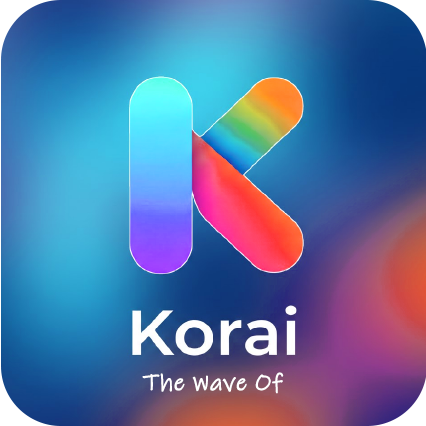
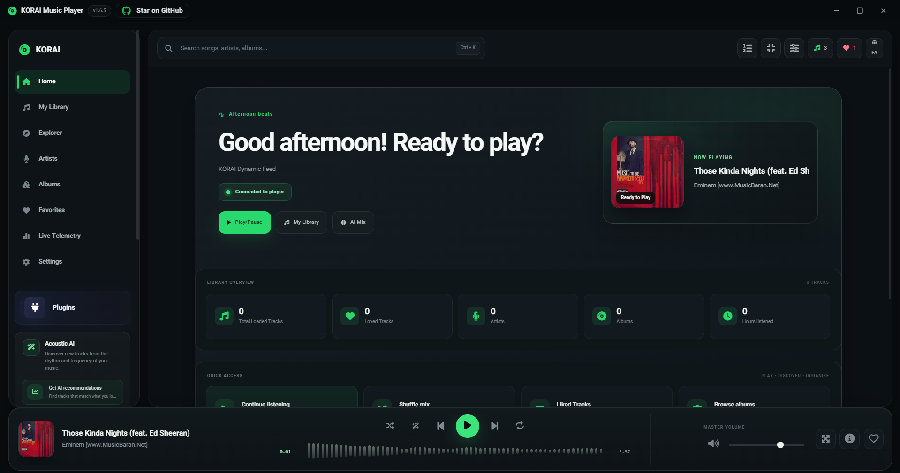
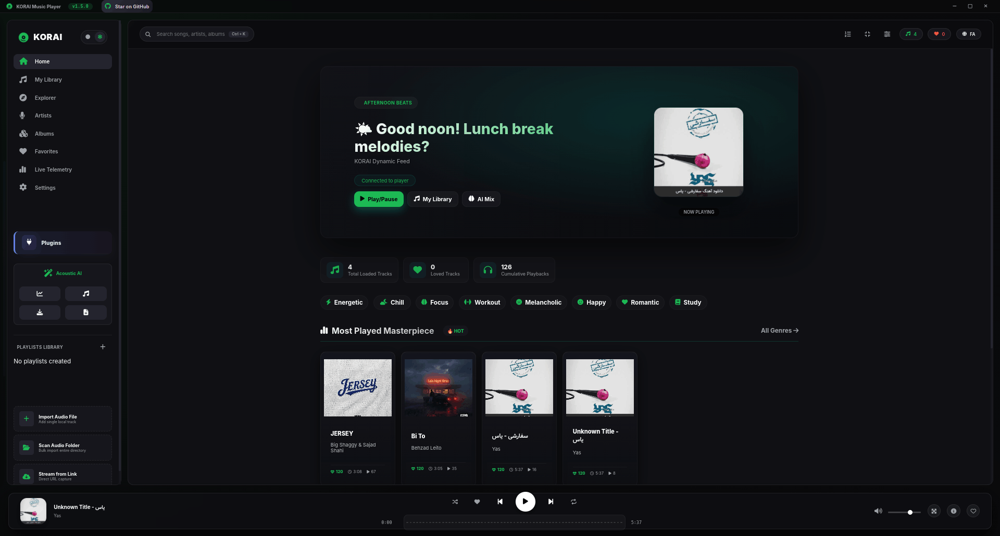
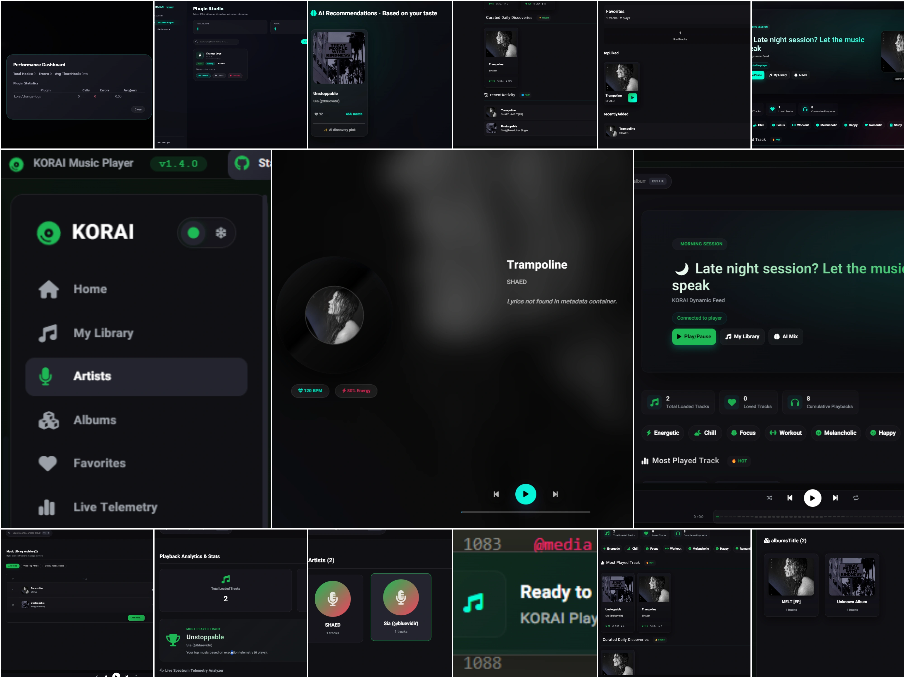
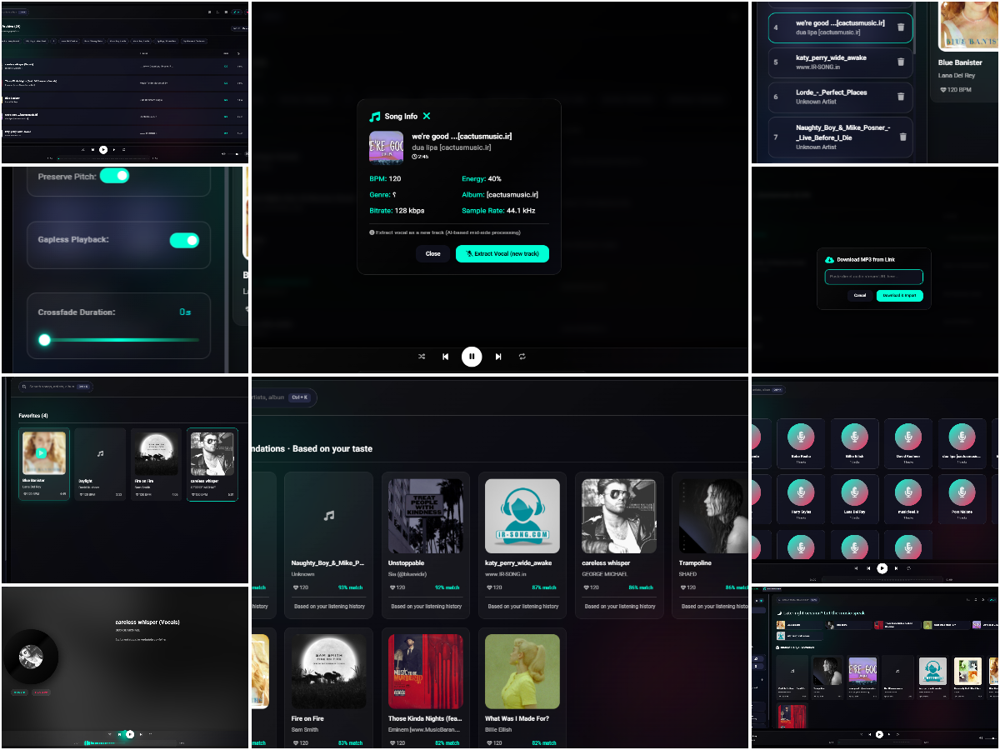

<div align="center">



# KORAI Player

### v1.6.5 · Local-first desktop music player

**A cleaner way to enjoy the music you already own.**

KORAI is a modern desktop music player built around your local music library.

It is designed to make managing and listening to your own files feel less like browsing folders and more like using a real music product — with a focused interface, fast playback, playlists, search, recommendations, visualization, plugin support, and full Persian/RTL support.

<p>
  <a href="https://github.com/Behdad-kanaani/korai-player/releases">
    
  </a>
  <a href="https://github.com/Behdad-kanaani/korai-player/releases">
    
  </a>
  <a href="https://github.com/Behdad-kanaani/korai-player/stargazers">
    
  </a>
  <a href="LICENSE">
    
  </a>
</p>

<p>
  
  
  
</p>

<p>
  <a href="https://github.com/Behdad-kanaani/korai-player/releases/latest"><strong>Download KORAI</strong></a>
  &nbsp;·&nbsp;
  <a href="https://github.com/Behdad-kanaani/korai-player/issues"><strong>Report an issue</strong></a>
  &nbsp;·&nbsp;
  <a href="https://github.com/Behdad-kanaani/korai-player/discussions"><strong>Discussions</strong></a>
</p>

</div>

---

# KORAI is changing

KORAI started with a simple idea:

**your local music library should feel as good to use as any modern music app.**

That idea shaped the 1.6.x redesign.

v1.6.5 is not just a visual refresh or a new color palette. The interface was reworked around clearer hierarchy, calmer surfaces, stronger typography, smoother states, better responsive behavior, and a more focused relationship between browsing and playback.

The goal is not to fill the screen with effects.

The goal is to make the player feel **natural, polished, fast, and intentional**.

> **KORAI is not trying to turn a local music folder into another streaming service.**
>
> **It is trying to make owning a music library feel good.**

---

# What is KORAI?

KORAI is a **local-first desktop music player** for people who keep their music as files.

Your music stays at the center of the experience. You can build a library from folders on your computer, browse albums and artists, create playlists, search your collection, edit metadata, analyze tracks, and listen without creating an account or paying for a subscription.

Optional online features are kept separate from the local playback experience.

That means KORAI can remain a complete music player even when you do not use its online features.

---

# A major redesign

The biggest change in v1.6.5 is the way KORAI **feels**.

Instead of treating every page as a separate interface, the redesign brings the application under one visual language.

### A more coherent interface

The redesigned UI focuses on:

- stronger layout hierarchy
- cleaner cards and surfaces
- more deliberate spacing
- calmer visual treatment
- improved player controls
- better home content
- cleaner settings and secondary pages
- smoother dialogs and transitions
- stronger responsive behavior
- improved keyboard focus
- better Persian typography
- lighter glass effects

The result is intentionally restrained.

**Less visual noise. More clarity. Better flow.**

---

# The KORAI experience

## Home

The home experience is designed to help you get back to your music quickly.

Your library, recent listening, favorites, playlists, and discovery-oriented content come together in a focused space instead of forcing you through a file-browser workflow.

---

## Library

KORAI treats your music collection as a real library.

You can:

- import folders and files
- scan metadata
- browse albums and artists
- manage favorites
- edit tags
- manage album artwork
- search your collection
- import and export playlists
- work with CUE sheets
- export library data as CSV

Supported playlist formats include:

**M3U · M3U8 · PLS · XSPF · ASX · WPL · JSON**

---

## Playback

Playback is built around the features expected from a full desktop player:

- MP3, WAV, FLAC, OGG and M4A
- gapless playback
- configurable crossfade
- 0.5×–2.0× tempo control
- pitch preservation
- repeat and smart shuffle
- resume on startup
- tray/background behavior
- media-key support
- fullscreen mode
- compact mini-player

---

# Audio analysis & visualization

KORAI goes beyond basic playback.

The player includes:

- 5-band EQ
- real-time spectrum visualization
- live waveform timeline
- BPM detection
- track analysis
- tempo control
- crossfade
- lightweight vocal extraction

### Real BPM analysis

One important improvement in v1.6.5 is that BPM analysis is now based on the actual recording instead of a synthetic waveform path.

KORAI can use an existing BPM tag when available. Otherwise it decodes a bounded mono preview through FFmpeg, builds an onset envelope, estimates tempo from the recording, and accounts for common half-time / double-time ambiguity.

This makes BPM a real audio-derived signal rather than a decorative value.

---

# Recommendations that stay local

KORAI can generate recommendations from signals already available inside your library and listening history.

These include:

- play history
- likes and skips
- BPM and energy
- genre relationships
- artist affinity
- recent listening context
- discovery preferences

The recommendation system is intentionally lightweight and local rather than relying on a large online model.

In v1.6.5, generated analyzer fields are deterministic, so analyzing the same file again produces stable feature values instead of changing recommendation signals randomly.

---

# Plugins

KORAI has a plugin architecture for extending the player without turning the core application into one giant feature set.

The current plugin system includes:

- isolated plugin workers
- permissions
- manifest validation
- performance monitoring
- lifecycle management
- hot reload
- CLI tooling
- plugin catalog support

The plugin catalog is registry-based and supports validation, search, version comparison, caching, remote loading, and local fallback.

---

# Persian & RTL support

Persian is part of the product design, not an afterthought.

KORAI bundles **Vazirmatn** and supports:

- Persian UI
- automatic RTL/LTR switching
- Persian metadata
- Persian search
- Settings
- Explorer
- player states
- dialogs and interaction labels

This makes KORAI comfortable to use in both Persian and English environments.

---

# Local-first by design

KORAI does not require:

- an account
- a subscription
- a premium tier

Your library, playlists, favorites, listening history, settings, and recommendation signals are designed around local application data. Optional online functionality remains separate from the local playback path.

**Your files. Your library. Your player.**

---

# Music Explorer

KORAI also includes an optional online discovery experience.

Music Explorer can connect to remote music services through the application integration layer and download supported results when the feature is used.

This functionality is intentionally separated from the local library path, so KORAI does not depend on online services to remain useful as a music player.

---

# Screenshots

<table>
  <tr>
    <td align="center" width="50%">
      <strong>v1.6.5</strong><br><br>
      
    </td>
    <td align="center" width="50%">
      <strong>v1.5.0</strong><br><br>
      
    </td>
  </tr>
  <tr>
    <td align="center" width="50%">
      <strong>v1.4.0</strong><br><br>
      
    </td>
    <td align="center" width="50%">
      <strong>v1.3.0</strong><br><br>
      
    </td>
  </tr>
</table>

---

# v1.5 → v1.6.5

v1.6.5 represents a broader product cleanup rather than a single isolated feature release.

| Area | v1.5.x | v1.6.5 |
|---|---|---|
| **Design** | Mature dark/glass interface | Refined, unified UI system |
| **Typography** | Persian support | Bundled Vazirmatn + stronger RTL presentation |
| **Motion** | Heavier visual paths | Simpler, smoother interactions |
| **Glass effects** | More prominent | Lighter and more restrained |
| **BPM** | Synthetic/mock waveform path | Real audio-based analysis |
| **Recommendations** | Variable heuristic values | Deterministic feature generation |
| **Plugins** | Legacy marketplace approach | Registry-based catalog |
| **Updater** | Earlier update path | Safer staged update flow |
| **Security** | Existing protections | Centralized validation and boundaries |
| **Dependencies** | Included legacy packages | Removed unused dependencies |
| **Release tooling** | Basic | Static audit + testing + security scanning |

The engineering direction is straightforward:

**less legacy code · tighter boundaries · deterministic behavior · cleaner UI**

---

# Security & reliability

The 1.6.5 release also strengthens the boundaries around files, URLs, plugins, downloads, IPC, and updates.

Security handling is centralized in:

```text
src/backend/securityUtils.js
```

The release adds protection around path traversal, unsafe URLs, plugin access, playlist and CUE paths, remote downloads, API rate limiting, and plugin lifecycle handling.

The updater was also redesigned around validation, staging, backup, rollback, and safer handling of packaged installations.

---

# Performance philosophy

KORAI does not chase performance by simply removing features.

Instead, v1.6.5 removes work that does not meaningfully improve the experience.

The renderer uses lighter visual treatment, simplified animation paths, optimization hooks, and debounced durable writes.

The goal is not an artificial benchmark number.

The goal is simple:

**the application should feel smooth without wasting resources on decoration.**

---

# Architecture

KORAI keeps the application divided between the Electron application layer, backend services, and frontend UI.

```text
korai-player/
├── main.js
├── preload.js
├── package.json
│
├── src/
│   ├── backend/
│   │   ├── analyzer.js
│   │   ├── bpmDetector.js
│   │   ├── cueParser.js
│   │   ├── database.js
│   │   ├── pluginHost.js
│   │   ├── pluginManager.js
│   │   ├── pluginRoutes.js
│   │   ├── pluginStore.js
│   │   ├── playlistExporter.js
│   │   ├── recommender.js
│   │   ├── securityUtils.js
│   │   ├── updateManager.js
│   │   └── updater.js
│   │
│   └── frontend/
│       ├── index.html
│       ├── explorer.html
│       ├── plugins.html
│       ├── settings.html
│       ├── app.js
│       ├── homePremium.js
│       ├── updateUI.js
│       ├── ui/
│       ├── styles/
│       └── assets/fonts/vazir/
│
├── plugins/
│   ├── registry.json
│   └── change-logs@1.0.0/
│
├── scripts/
├── .github/
├── korai.png
├── korai.ico
└── LICENSE
```

---

# Built with

KORAI builds on established open-source technologies:

- [Electron](https://www.electronjs.org/)
- [FFmpeg](https://ffmpeg.org/)
- [music-metadata](https://github.com/Borewit/music-metadata)
- [Express](https://expressjs.com/)
- [Vazirmatn](https://github.com/rastikerdar/vazirmatn)
- [Ajv](https://ajv.js.org/)
- [Chokidar](https://github.com/paulmillr/chokidar)
- [Sharp](https://sharp.pixelplumbing.com/)
- [semver](https://github.com/npm/node-semver)

---

# Development

Recommended environment:

```text
Node.js 20 LTS
npm 9+
```

Start the application:

```bash
npm install
npm start
```

Run the main checks:

```bash
npm test
npm run audit:static
npm run check
npm run plugin
```

Create a Windows installer:

```bash
npm run dist:win
```

Plugin development is also available through the included CLI:

```bash
npm run plugin -- create my-plugin
```

The release includes static auditing and GitHub Actions-based security scanning as part of the project hygiene and release workflow.

---

# Release

### v1.6.5

The release contains a substantial cleanup and redesign pass:

**19 commits · 90 files changed · 10,460 additions · 13,081 deletions**

The important part is not the size of the diff.

It is the direction of the project:

> **Cleaner interface.**
>
> **Simpler behavior.**
>
> **Stronger foundations.**
>
> **Less legacy.**


---

# Contributing

KORAI is an evolving open-source project.

Issues, ideas, technical feedback, and improvements are welcome through GitHub.

<a href="https://github.com/Behdad-kanaani/korai-player/issues">Issues</a>
&nbsp;·&nbsp;
<a href="https://github.com/Behdad-kanaani/korai-player/discussions">Discussions</a>

---

# License

**Apache License 2.0 + Commons Clause**

Copyright © 2026 Behdad Kanaani.

See [`LICENSE`](LICENSE) for the exact terms.

---

<div align="center">

### KORAI Player v1.6.5

**Free. Local-first. Built for people who own their music.**

<a href="https://github.com/Behdad-kanaani/korai-player/releases/latest">Download KORAI</a>

</div>